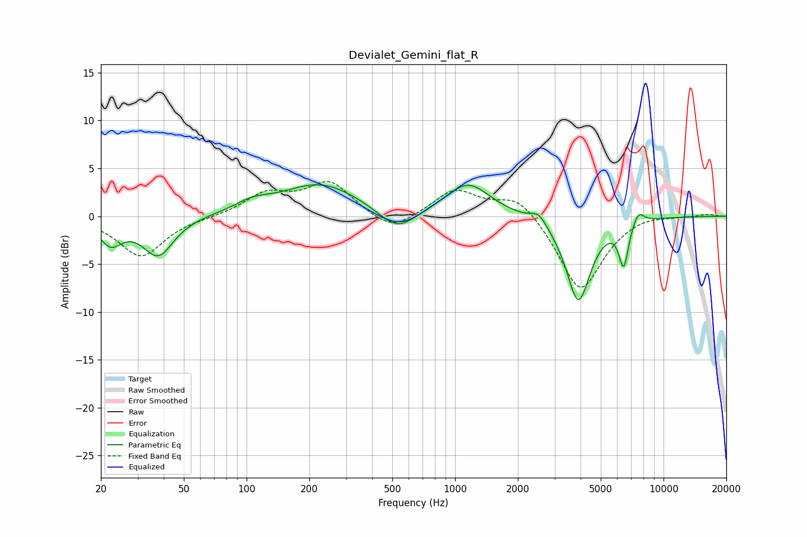

# Devialet_Gemini_flat_R
See [usage instructions](https://github.com/jaakkopasanen/AutoEq#usage) for more options and info.

### Parametric EQs
Apply preamp of -3.4 dB when using parametric equalizer.

|   # | Type    |   Fc (Hz) |    Q |   Gain (dB) |
|-----|---------|-----------|------|-------------|
|   1 | Peaking |        22 | 2.61 |        -2.5 |
|   2 | Peaking |        38 | 1.91 |        -4.1 |
|   3 | Peaking |       107 | 1.73 |         0.9 |
|   4 | Peaking |       226 | 0.75 |         3.4 |
|   5 | Peaking |       528 | 1.58 |        -2.4 |
|   6 | Peaking |      1155 | 1.34 |         3.4 |
|   7 | Peaking |      2517 | 3.74 |         1.2 |
|   8 | Peaking |      3903 | 2.38 |        -8.9 |
|   9 | Peaking |      6440 | 6    |        -4.5 |
|  10 | Peaking |      7570 | 4.86 |         1.4 |

### Fixed Band EQs
When using fixed band (also called graphic) equalizer, apply preamp of **-3.7 dB** (if available) and set gains manually with these parameters.

|   # | Type    |   Fc (Hz) |    Q |   Gain (dB) |
|-----|---------|-----------|------|-------------|
|   1 | Peaking |        31 | 1.41 |        -4.2 |
|   2 | Peaking |        62 | 1.41 |        -0.1 |
|   3 | Peaking |       125 | 1.41 |         2.2 |
|   4 | Peaking |       250 | 1.41 |         3.5 |
|   5 | Peaking |       500 | 1.41 |        -1.9 |
|   6 | Peaking |      1000 | 1.41 |         2.8 |
|   7 | Peaking |      2000 | 1.41 |         2.4 |
|   8 | Peaking |      4000 | 1.41 |        -8   |
|   9 | Peaking |      8000 | 1.41 |         0.4 |
|  10 | Peaking |     16000 | 1.41 |         0.2 |

### Graphs

