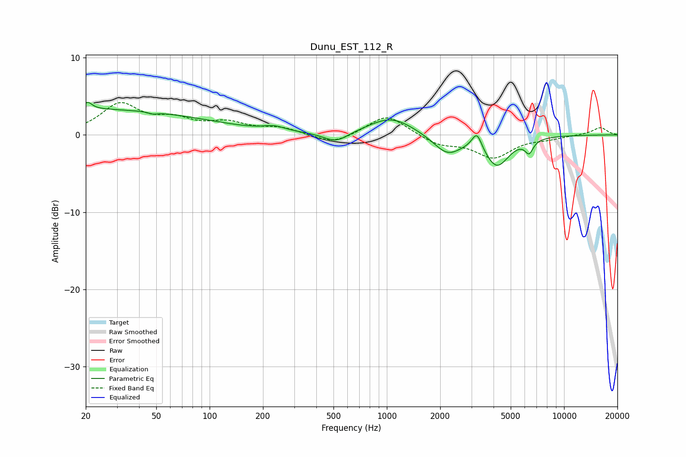

# Dunu_EST_112_R
See [usage instructions](https://github.com/jaakkopasanen/AutoEq#usage) for more options and info.

### Parametric EQs
Apply preamp of -4.3 dB when using parametric equalizer.

|   # | Type    |   Fc (Hz) |    Q |   Gain (dB) |
|-----|---------|-----------|------|-------------|
|   1 | Peaking |        20 | 0.18 |         3.3 |
|   2 | Peaking |        21 | 5.89 |         0.9 |
|   3 | Peaking |        48 | 5.98 |        -0.2 |
|   4 | Peaking |       232 | 2.33 |         0.6 |
|   5 | Peaking |       516 | 2.01 |        -1.3 |
|   6 | Peaking |      1059 | 1.11 |         2.3 |
|   7 | Peaking |      2195 | 1.78 |        -2.5 |
|   8 | Peaking |      3223 | 5.09 |         2.2 |
|   9 | Peaking |      4178 | 2.03 |        -3.9 |
|  10 | Peaking |      6350 | 6    |        -1.6 |

### Fixed Band EQs
When using fixed band (also called graphic) equalizer, apply preamp of **-4.3 dB** (if available) and set gains manually with these parameters.

|   # | Type    |   Fc (Hz) |    Q |   Gain (dB) |
|-----|---------|-----------|------|-------------|
|   1 | Peaking |        31 | 1.41 |         3.8 |
|   2 | Peaking |        62 | 1.41 |         1.7 |
|   3 | Peaking |       125 | 1.41 |         1.4 |
|   4 | Peaking |       250 | 1.41 |         0.8 |
|   5 | Peaking |       500 | 1.41 |        -1.3 |
|   6 | Peaking |      1000 | 1.41 |         2.7 |
|   7 | Peaking |      2000 | 1.41 |        -1.2 |
|   8 | Peaking |      4000 | 1.41 |        -2.8 |
|   9 | Peaking |      8000 | 1.41 |        -0.4 |
|  10 | Peaking |     16000 | 1.41 |         1   |

### Graphs

