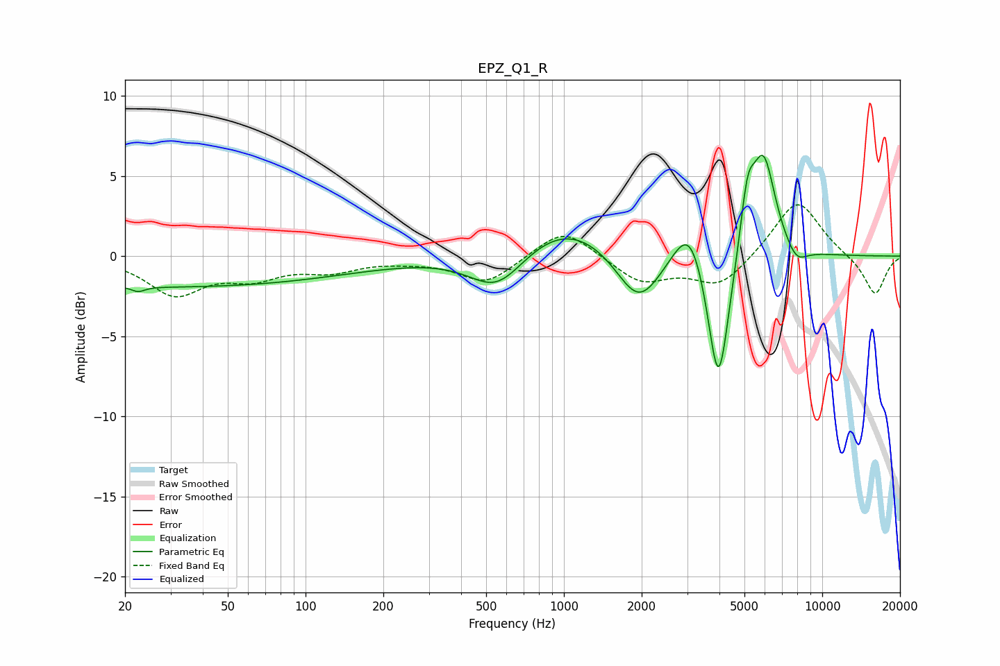

# EPZ_Q1_R
See [usage instructions](https://github.com/jaakkopasanen/AutoEq#usage) for more options and info.

### Parametric EQs
Apply preamp of -6.4 dB when using parametric equalizer.

|   # | Type    |   Fc (Hz) |    Q |   Gain (dB) |
|-----|---------|-----------|------|-------------|
|   1 | Peaking |        22 | 5.69 |        -0.3 |
|   2 | Peaking |        29 | 0.18 |        -1.9 |
|   3 | Peaking |       552 | 1.3  |        -2.5 |
|   4 | Peaking |      1014 | 0.74 |         2.3 |
|   5 | Peaking |      1948 | 1.61 |        -3.5 |
|   6 | Peaking |      3076 | 2.26 |         3.1 |
|   7 | Peaking |      3966 | 3.29 |        -9.2 |
|   8 | Peaking |      5133 | 4.87 |         3.6 |
|   9 | Peaking |      5927 | 2.92 |         6.2 |
|  10 | Peaking |      7933 | 3.2  |        -1   |

### Fixed Band EQs
When using fixed band (also called graphic) equalizer, apply preamp of **-3.3 dB** (if available) and set gains manually with these parameters.

|   # | Type    |   Fc (Hz) |    Q |   Gain (dB) |
|-----|---------|-----------|------|-------------|
|   1 | Peaking |        31 | 1.41 |        -2.3 |
|   2 | Peaking |        62 | 1.41 |        -1.1 |
|   3 | Peaking |       125 | 1.41 |        -0.8 |
|   4 | Peaking |       250 | 1.41 |        -0.2 |
|   5 | Peaking |       500 | 1.41 |        -1.7 |
|   6 | Peaking |      1000 | 1.41 |         1.9 |
|   7 | Peaking |      2000 | 1.41 |        -1.6 |
|   8 | Peaking |      4000 | 1.41 |        -1.9 |
|   9 | Peaking |      8000 | 1.41 |         3.6 |
|  10 | Peaking |     16000 | 1.41 |        -2.5 |

### Graphs

