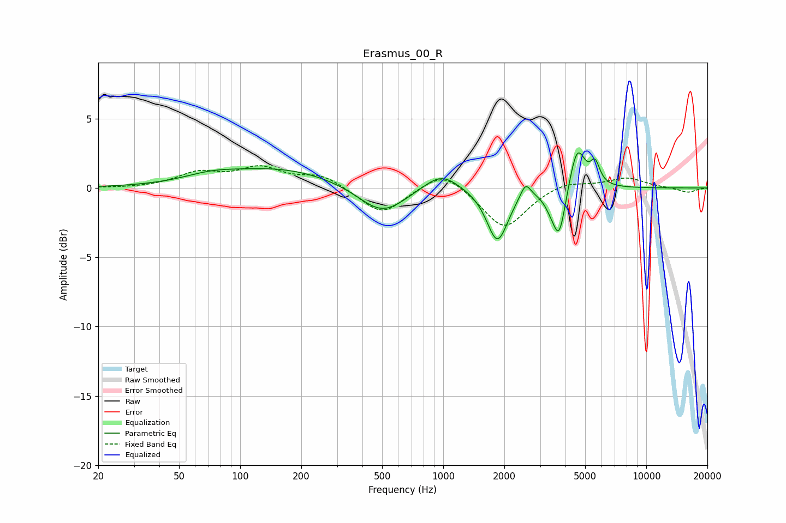

# Erasmus_00_R
See [usage instructions](https://github.com/jaakkopasanen/AutoEq#usage) for more options and info.

### Parametric EQs
Apply preamp of -2.6 dB when using parametric equalizer.

|   # | Type    |   Fc (Hz) |    Q |   Gain (dB) |
|-----|---------|-----------|------|-------------|
|   1 | Peaking |        72 | 1.09 |         0.5 |
|   2 | Peaking |       158 | 0.51 |         1.4 |
|   3 | Peaking |       499 | 1.21 |        -2.1 |
|   4 | Peaking |       976 | 1.64 |         1.3 |
|   5 | Peaking |      1848 | 2.74 |        -3.9 |
|   6 | Peaking |      2542 | 5.5  |         1.1 |
|   7 | Peaking |      3356 | 4.63 |        -0.5 |
|   8 | Peaking |      3724 | 4.42 |        -3.6 |
|   9 | Peaking |      4568 | 3.67 |         3.2 |
|  10 | Peaking |      5597 | 6    |         1.5 |

### Fixed Band EQs
When using fixed band (also called graphic) equalizer, apply preamp of **-1.7 dB** (if available) and set gains manually with these parameters.

|   # | Type    |   Fc (Hz) |    Q |   Gain (dB) |
|-----|---------|-----------|------|-------------|
|   1 | Peaking |        31 | 1.41 |        -0   |
|   2 | Peaking |        62 | 1.41 |         1   |
|   3 | Peaking |       125 | 1.41 |         1.3 |
|   4 | Peaking |       250 | 1.41 |         0.9 |
|   5 | Peaking |       500 | 1.41 |        -2   |
|   6 | Peaking |      1000 | 1.41 |         1.4 |
|   7 | Peaking |      2000 | 1.41 |        -3   |
|   8 | Peaking |      4000 | 1.41 |         0.5 |
|   9 | Peaking |      8000 | 1.41 |         0.7 |
|  10 | Peaking |     16000 | 1.41 |        -0.3 |

### Graphs

