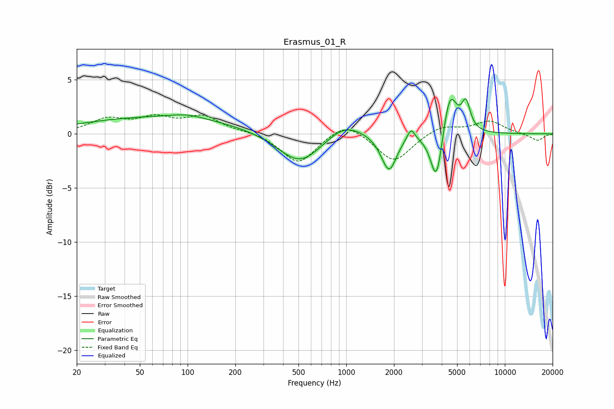

# Erasmus_01_R
See [usage instructions](https://github.com/jaakkopasanen/AutoEq#usage) for more options and info.

### Parametric EQs
Apply preamp of -3.4 dB when using parametric equalizer.

|   # | Type    |   Fc (Hz) |    Q |   Gain (dB) |
|-----|---------|-----------|------|-------------|
|   1 | Peaking |        68 | 0.27 |         1.5 |
|   2 | Peaking |        99 | 1.41 |         0.4 |
|   3 | Peaking |       510 | 1.02 |        -2.9 |
|   4 | Peaking |       972 | 1.25 |         1.4 |
|   5 | Peaking |      1725 | 2.4  |        -0.3 |
|   6 | Peaking |      1867 | 3.14 |        -3.1 |
|   7 | Peaking |      2559 | 5.99 |         1.1 |
|   8 | Peaking |      3707 | 3.79 |        -5   |
|   9 | Peaking |      4499 | 3.21 |         4.2 |
|  10 | Peaking |      5688 | 5.2  |         2.5 |

### Fixed Band EQs
When using fixed band (also called graphic) equalizer, apply preamp of **-1.9 dB** (if available) and set gains manually with these parameters.

|   # | Type    |   Fc (Hz) |    Q |   Gain (dB) |
|-----|---------|-----------|------|-------------|
|   1 | Peaking |        31 | 1.41 |         1.3 |
|   2 | Peaking |        62 | 1.41 |         1.3 |
|   3 | Peaking |       125 | 1.41 |         1.5 |
|   4 | Peaking |       250 | 1.41 |         0.2 |
|   5 | Peaking |       500 | 1.41 |        -2.8 |
|   6 | Peaking |      1000 | 1.41 |         1.3 |
|   7 | Peaking |      2000 | 1.41 |        -2.6 |
|   8 | Peaking |      4000 | 1.41 |         0.8 |
|   9 | Peaking |      8000 | 1.41 |         1.2 |
|  10 | Peaking |     16000 | 1.41 |        -0.7 |

### Graphs

