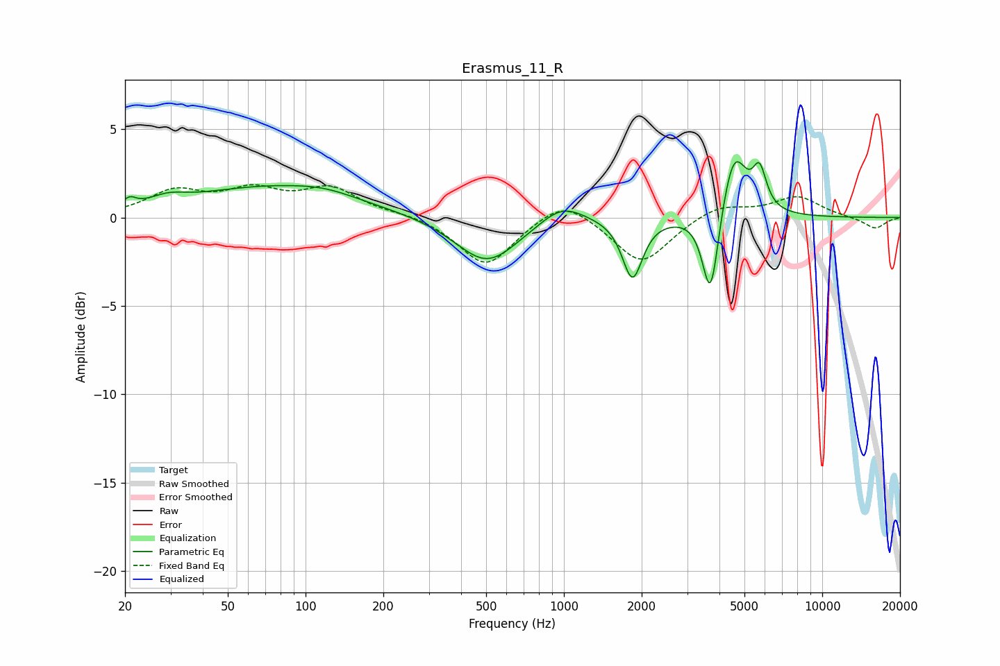

# Erasmus_11_R
See [usage instructions](https://github.com/jaakkopasanen/AutoEq#usage) for more options and info.

### Parametric EQs
Apply preamp of -3.3 dB when using parametric equalizer.

|   # | Type    |   Fc (Hz) |    Q |   Gain (dB) |
|-----|---------|-----------|------|-------------|
|   1 | Peaking |        21 | 5.87 |         0.5 |
|   2 | Peaking |        29 | 2.07 |         0.5 |
|   3 | Peaking |        74 | 0.44 |         1.7 |
|   4 | Peaking |       119 | 1.26 |         0.3 |
|   5 | Peaking |       504 | 1.17 |        -2.7 |
|   6 | Peaking |       983 | 1.66 |         1.1 |
|   7 | Peaking |      1842 | 3.68 |        -3.4 |
|   8 | Peaking |      3697 | 4.49 |        -5.1 |
|   9 | Peaking |      4551 | 2.88 |         3.9 |
|  10 | Peaking |      5722 | 5.32 |         2.1 |

### Fixed Band EQs
When using fixed band (also called graphic) equalizer, apply preamp of **-2.0 dB** (if available) and set gains manually with these parameters.

|   # | Type    |   Fc (Hz) |    Q |   Gain (dB) |
|-----|---------|-----------|------|-------------|
|   1 | Peaking |        31 | 1.41 |         1.4 |
|   2 | Peaking |        62 | 1.41 |         1.3 |
|   3 | Peaking |       125 | 1.41 |         1.5 |
|   4 | Peaking |       250 | 1.41 |         0.2 |
|   5 | Peaking |       500 | 1.41 |        -2.8 |
|   6 | Peaking |      1000 | 1.41 |         1.3 |
|   7 | Peaking |      2000 | 1.41 |        -2.7 |
|   8 | Peaking |      4000 | 1.41 |         0.8 |
|   9 | Peaking |      8000 | 1.41 |         1.2 |
|  10 | Peaking |     16000 | 1.41 |        -0.6 |

### Graphs

