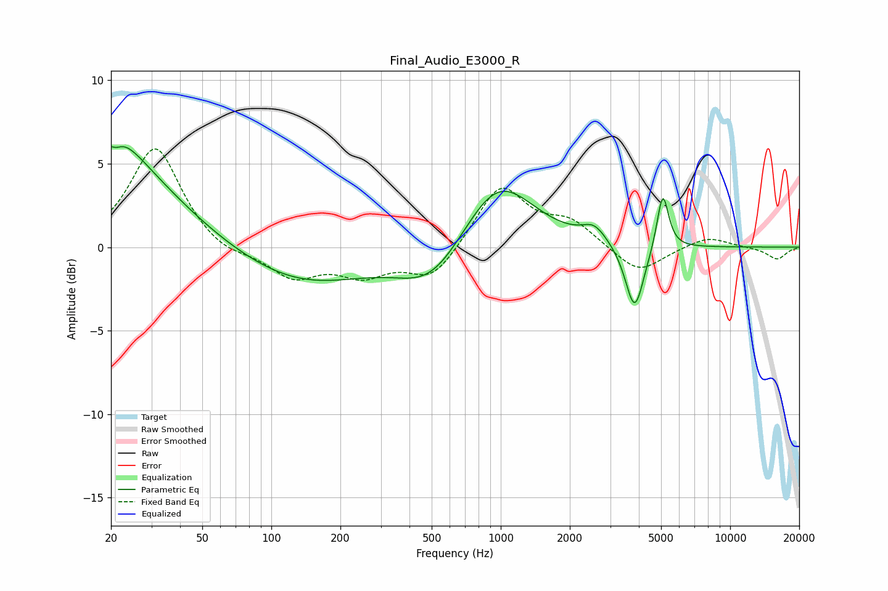

# Final_Audio_E3000_R
See [usage instructions](https://github.com/jaakkopasanen/AutoEq#usage) for more options and info.

### Parametric EQs
Apply preamp of -6.1 dB when using parametric equalizer.

|   # | Type    |   Fc (Hz) |    Q |   Gain (dB) |
|-----|---------|-----------|------|-------------|
|   1 | Peaking |        21 | 5.97 |         3.2 |
|   2 | Peaking |        21 | 5.97 |        -3.5 |
|   3 | Peaking |        21 | 1.43 |         1.8 |
|   4 | Peaking |        22 | 0.53 |         4.7 |
|   5 | Peaking |       136 | 0.49 |        -2.2 |
|   6 | Peaking |       501 | 0.97 |        -2.5 |
|   7 | Peaking |       971 | 0.91 |         4.3 |
|   8 | Peaking |      2558 | 2.65 |         0.9 |
|   9 | Peaking |      3835 | 3.48 |        -4   |
|  10 | Peaking |      5085 | 5.57 |         3.5 |

### Fixed Band EQs
When using fixed band (also called graphic) equalizer, apply preamp of **-6.0 dB** (if available) and set gains manually with these parameters.

|   # | Type    |   Fc (Hz) |    Q |   Gain (dB) |
|-----|---------|-----------|------|-------------|
|   1 | Peaking |        31 | 1.41 |         6.1 |
|   2 | Peaking |        62 | 1.41 |        -0.6 |
|   3 | Peaking |       125 | 1.41 |        -1.7 |
|   4 | Peaking |       250 | 1.41 |        -1.5 |
|   5 | Peaking |       500 | 1.41 |        -1.9 |
|   6 | Peaking |      1000 | 1.41 |         3.7 |
|   7 | Peaking |      2000 | 1.41 |         1.4 |
|   8 | Peaking |      4000 | 1.41 |        -1.6 |
|   9 | Peaking |      8000 | 1.41 |         0.7 |
|  10 | Peaking |     16000 | 1.41 |        -0.7 |

### Graphs

