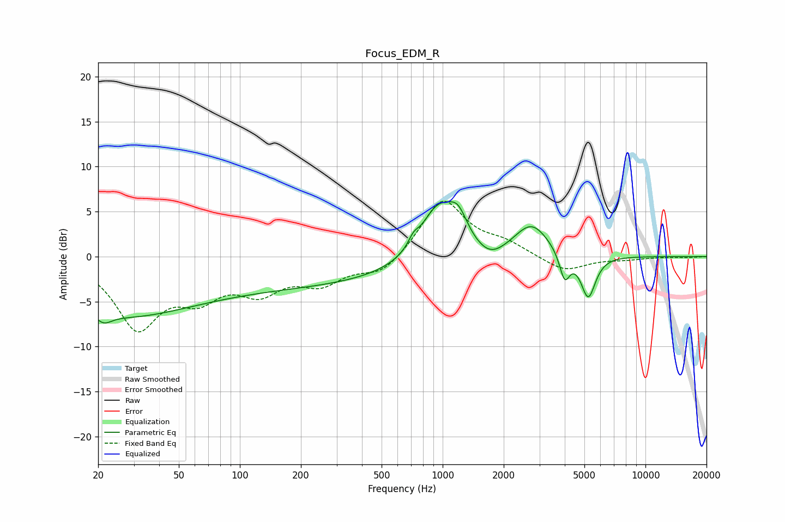

# Focus_EDM_R
See [usage instructions](https://github.com/jaakkopasanen/AutoEq#usage) for more options and info.

### Parametric EQs
Apply preamp of -6.2 dB when using parametric equalizer.

|   # | Type    |   Fc (Hz) |    Q |   Gain (dB) |
|-----|---------|-----------|------|-------------|
|   1 | Peaking |        21 | 3.58 |        -1.1 |
|   2 | Peaking |        25 | 0.41 |        -5.8 |
|   3 | Peaking |       191 | 0.25 |        -3.1 |
|   4 | Peaking |       718 | 5.69 |         0.9 |
|   5 | Peaking |       945 | 1.62 |         5.9 |
|   6 | Peaking |      1191 | 2.96 |         3   |
|   7 | Peaking |      1718 | 2.04 |        -1.3 |
|   8 | Peaking |      2744 | 1.64 |         3.7 |
|   9 | Peaking |      3995 | 5.61 |        -3.1 |
|  10 | Peaking |      5222 | 3.89 |        -4.8 |

### Fixed Band EQs
When using fixed band (also called graphic) equalizer, apply preamp of **-6.2 dB** (if available) and set gains manually with these parameters.

|   # | Type    |   Fc (Hz) |    Q |   Gain (dB) |
|-----|---------|-----------|------|-------------|
|   1 | Peaking |        31 | 1.41 |        -7.6 |
|   2 | Peaking |        62 | 1.41 |        -3.6 |
|   3 | Peaking |       125 | 1.41 |        -3.3 |
|   4 | Peaking |       250 | 1.41 |        -2.6 |
|   5 | Peaking |       500 | 1.41 |        -2   |
|   6 | Peaking |      1000 | 1.41 |         6.5 |
|   7 | Peaking |      2000 | 1.41 |         1.3 |
|   8 | Peaking |      4000 | 1.41 |        -1.7 |
|   9 | Peaking |      8000 | 1.41 |        -0.3 |
|  10 | Peaking |     16000 | 1.41 |        -0.1 |

### Graphs

