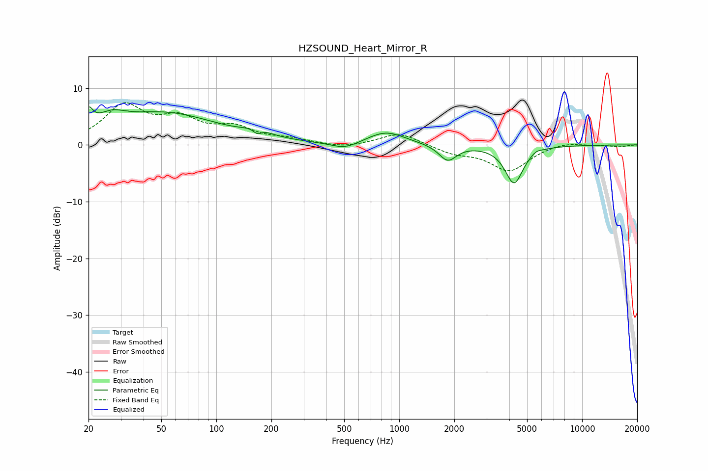

# HZSOUND_Heart_Mirror_R
See [usage instructions](https://github.com/jaakkopasanen/AutoEq#usage) for more options and info.

### Parametric EQs
Apply preamp of -6.8 dB when using parametric equalizer.

|   # | Type    |   Fc (Hz) |    Q |   Gain (dB) |
|-----|---------|-----------|------|-------------|
|   1 | Peaking |        20 | 6    |         3.1 |
|   2 | Peaking |        26 | 1.79 |         2.3 |
|   3 | Peaking |        52 | 0.49 |         5.4 |
|   4 | Peaking |       167 | 2.18 |         1.3 |
|   5 | Peaking |       167 | 5.85 |        -1.2 |
|   6 | Peaking |       504 | 1.87 |        -1.2 |
|   7 | Peaking |       847 | 1.37 |         2.3 |
|   8 | Peaking |      1841 | 2.99 |        -2.8 |
|   9 | Peaking |      4245 | 2.85 |        -6.7 |
|  10 | Peaking |      5601 | 5.1  |         0.5 |

### Fixed Band EQs
When using fixed band (also called graphic) equalizer, apply preamp of **-7.5 dB** (if available) and set gains manually with these parameters.

|   # | Type    |   Fc (Hz) |    Q |   Gain (dB) |
|-----|---------|-----------|------|-------------|
|   1 | Peaking |        31 | 1.41 |         6.6 |
|   2 | Peaking |        62 | 1.41 |         3.9 |
|   3 | Peaking |       125 | 1.41 |         2.6 |
|   4 | Peaking |       250 | 1.41 |         0.8 |
|   5 | Peaking |       500 | 1.41 |        -0.6 |
|   6 | Peaking |      1000 | 1.41 |         2.2 |
|   7 | Peaking |      2000 | 1.41 |        -1.3 |
|   8 | Peaking |      4000 | 1.41 |        -4.5 |
|   9 | Peaking |      8000 | 1.41 |         0.6 |
|  10 | Peaking |     16000 | 1.41 |        -0.3 |

### Graphs

