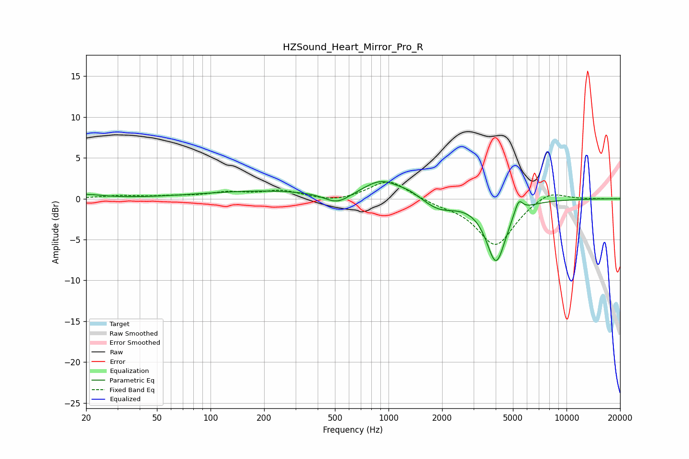

# HZSound_Heart_Mirror_Pro_R
See [usage instructions](https://github.com/jaakkopasanen/AutoEq#usage) for more options and info.

### Parametric EQs
Apply preamp of -2.2 dB when using parametric equalizer.

|   # | Type    |   Fc (Hz) |    Q |   Gain (dB) |
|-----|---------|-----------|------|-------------|
|   1 | Peaking |        20 | 1.62 |         0.5 |
|   2 | Peaking |       102 | 2.74 |         0   |
|   3 | Peaking |       209 | 0.38 |         1   |
|   4 | Peaking |       515 | 1.94 |        -1.4 |
|   5 | Peaking |       913 | 1.39 |         2.1 |
|   6 | Peaking |      1312 | 2.11 |         0.6 |
|   7 | Peaking |      1924 | 1.54 |        -1.4 |
|   8 | Peaking |      4019 | 2.54 |        -7.4 |
|   9 | Peaking |      4113 | 2.89 |        -0.2 |
|  10 | Peaking |      5381 | 6    |         1.8 |

### Fixed Band EQs
When using fixed band (also called graphic) equalizer, apply preamp of **-2.1 dB** (if available) and set gains manually with these parameters.

|   # | Type    |   Fc (Hz) |    Q |   Gain (dB) |
|-----|---------|-----------|------|-------------|
|   1 | Peaking |        31 | 1.41 |         0.3 |
|   2 | Peaking |        62 | 1.41 |         0.2 |
|   3 | Peaking |       125 | 1.41 |         0.7 |
|   4 | Peaking |       250 | 1.41 |         0.9 |
|   5 | Peaking |       500 | 1.41 |        -0.5 |
|   6 | Peaking |      1000 | 1.41 |         2.4 |
|   7 | Peaking |      2000 | 1.41 |        -0.5 |
|   8 | Peaking |      4000 | 1.41 |        -5.7 |
|   9 | Peaking |      8000 | 1.41 |         1.2 |
|  10 | Peaking |     16000 | 1.41 |        -0   |

### Graphs

