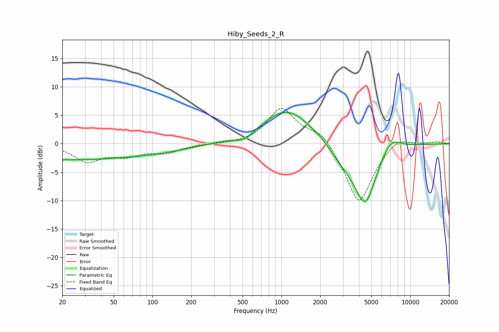

# Hiby_Seeds_2_R
See [usage instructions](https://github.com/jaakkopasanen/AutoEq#usage) for more options and info.

### Parametric EQs
Apply preamp of -5.6 dB when using parametric equalizer.

|   # | Type    |   Fc (Hz) |    Q |   Gain (dB) |
|-----|---------|-----------|------|-------------|
|   1 | Peaking |        20 | 0.25 |        -2.7 |
|   2 | Peaking |        20 | 5.85 |        -2.7 |
|   3 | Peaking |        20 | 6    |         2.7 |
|   4 | Peaking |       114 | 0.57 |        -0.9 |
|   5 | Peaking |       515 | 2.22 |        -1.3 |
|   6 | Peaking |      1112 | 0.75 |         6.2 |
|   7 | Peaking |      2172 | 1.51 |         0.8 |
|   8 | Peaking |      2824 | 1.2  |        -2.5 |
|   9 | Peaking |      4469 | 1.53 |       -10.6 |
|  10 | Peaking |      7014 | 1.68 |         3   |

### Fixed Band EQs
When using fixed band (also called graphic) equalizer, apply preamp of **-6.3 dB** (if available) and set gains manually with these parameters.

|   # | Type    |   Fc (Hz) |    Q |   Gain (dB) |
|-----|---------|-----------|------|-------------|
|   1 | Peaking |        31 | 1.41 |        -3   |
|   2 | Peaking |        62 | 1.41 |        -1.8 |
|   3 | Peaking |       125 | 1.41 |        -1.4 |
|   4 | Peaking |       250 | 1.41 |        -0.1 |
|   5 | Peaking |       500 | 1.41 |        -0.1 |
|   6 | Peaking |      1000 | 1.41 |         6.2 |
|   7 | Peaking |      2000 | 1.41 |         2.5 |
|   8 | Peaking |      4000 | 1.41 |       -10.8 |
|   9 | Peaking |      8000 | 1.41 |         1.7 |
|  10 | Peaking |     16000 | 1.41 |         0.4 |

### Graphs

