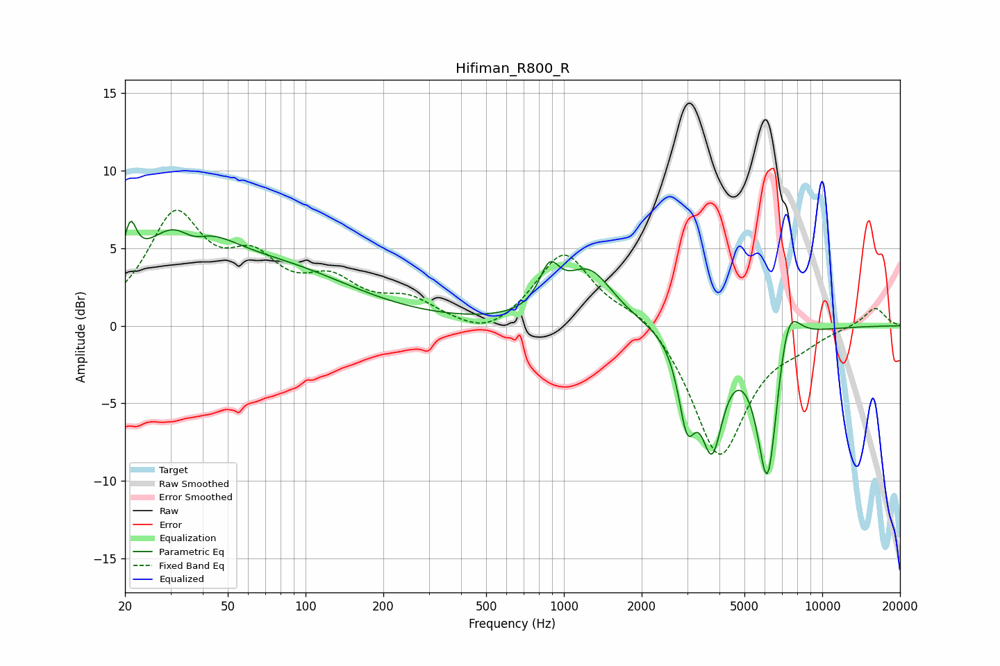

# Hifiman_R800_R
See [usage instructions](https://github.com/jaakkopasanen/AutoEq#usage) for more options and info.

### Parametric EQs
Apply preamp of -6.8 dB when using parametric equalizer.

|   # | Type    |   Fc (Hz) |    Q |   Gain (dB) |
|-----|---------|-----------|------|-------------|
|   1 | Peaking |        21 | 5.88 |         2.9 |
|   2 | Peaking |        33 | 0.9  |         6.1 |
|   3 | Peaking |        36 | 2.27 |        -1.7 |
|   4 | Peaking |        86 | 0.51 |         2.9 |
|   5 | Peaking |       879 | 3.64 |         2.5 |
|   6 | Peaking |      1249 | 1.51 |         3.4 |
|   7 | Peaking |      2996 | 4.27 |        -4.9 |
|   8 | Peaking |      3743 | 3.24 |        -6.8 |
|   9 | Peaking |      6145 | 3.26 |       -10.4 |
|  10 | Peaking |      7347 | 2.96 |         3.6 |

### Fixed Band EQs
When using fixed band (also called graphic) equalizer, apply preamp of **-7.5 dB** (if available) and set gains manually with these parameters.

|   # | Type    |   Fc (Hz) |    Q |   Gain (dB) |
|-----|---------|-----------|------|-------------|
|   1 | Peaking |        31 | 1.41 |         6.7 |
|   2 | Peaking |        62 | 1.41 |         3.4 |
|   3 | Peaking |       125 | 1.41 |         2.4 |
|   4 | Peaking |       250 | 1.41 |         1.4 |
|   5 | Peaking |       500 | 1.41 |        -1   |
|   6 | Peaking |      1000 | 1.41 |         4.8 |
|   7 | Peaking |      2000 | 1.41 |         1.2 |
|   8 | Peaking |      4000 | 1.41 |        -8.5 |
|   9 | Peaking |      8000 | 1.41 |        -0.7 |
|  10 | Peaking |     16000 | 1.41 |         1.2 |

### Graphs

