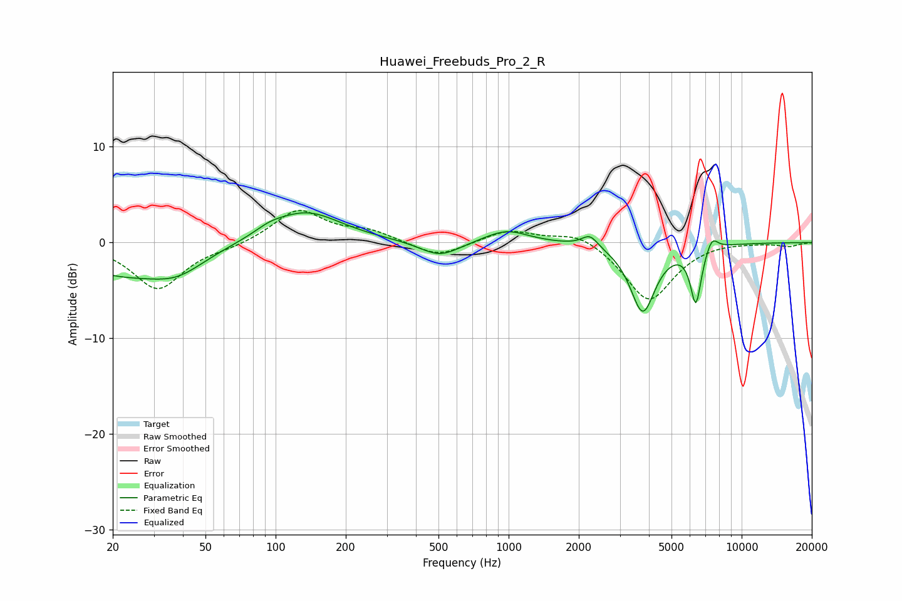

# Huawei_Freebuds_Pro_2_R
See [usage instructions](https://github.com/jaakkopasanen/AutoEq#usage) for more options and info.

### Parametric EQs
Apply preamp of -3.2 dB when using parametric equalizer.

|   # | Type    |   Fc (Hz) |    Q |   Gain (dB) |
|-----|---------|-----------|------|-------------|
|   1 | Peaking |        21 | 0.65 |        -3   |
|   2 | Peaking |        38 | 1.18 |        -2.1 |
|   3 | Peaking |        94 | 2.22 |         0.6 |
|   4 | Peaking |       135 | 0.93 |         3.3 |
|   5 | Peaking |       507 | 1.64 |        -1.6 |
|   6 | Peaking |       978 | 1.52 |         1.4 |
|   7 | Peaking |      2233 | 4.06 |         1.3 |
|   8 | Peaking |      3763 | 2.61 |        -7.2 |
|   9 | Peaking |      6361 | 5.86 |        -5.9 |
|  10 | Peaking |      7454 | 5.31 |         1.5 |

### Fixed Band EQs
When using fixed band (also called graphic) equalizer, apply preamp of **-3.4 dB** (if available) and set gains manually with these parameters.

|   # | Type    |   Fc (Hz) |    Q |   Gain (dB) |
|-----|---------|-----------|------|-------------|
|   1 | Peaking |        31 | 1.41 |        -4.9 |
|   2 | Peaking |        62 | 1.41 |        -0.4 |
|   3 | Peaking |       125 | 1.41 |         3.4 |
|   4 | Peaking |       250 | 1.41 |         1.1 |
|   5 | Peaking |       500 | 1.41 |        -1.6 |
|   6 | Peaking |      1000 | 1.41 |         1.3 |
|   7 | Peaking |      2000 | 1.41 |         1.3 |
|   8 | Peaking |      4000 | 1.41 |        -6.2 |
|   9 | Peaking |      8000 | 1.41 |         0.2 |
|  10 | Peaking |     16000 | 1.41 |        -0.4 |

### Graphs

