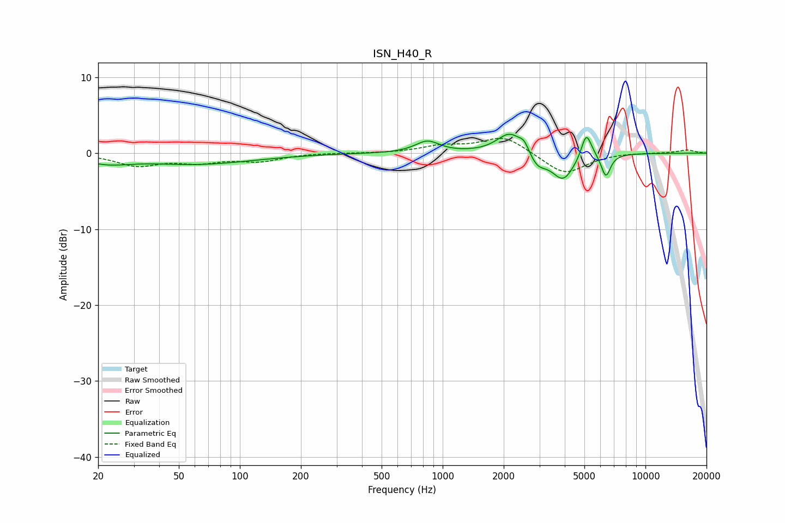

# ISN_H40_R
See [usage instructions](https://github.com/jaakkopasanen/AutoEq#usage) for more options and info.

### Parametric EQs
Apply preamp of -2.6 dB when using parametric equalizer.

|   # | Type    |   Fc (Hz) |    Q |   Gain (dB) |
|-----|---------|-----------|------|-------------|
|   1 | Peaking |        22 | 1.25 |        -1   |
|   2 | Peaking |        62 | 0.51 |        -1.4 |
|   3 | Peaking |       841 | 2.4  |         1.5 |
|   4 | Peaking |      2149 | 2.22 |         2.8 |
|   5 | Peaking |      2527 | 6    |         1.1 |
|   6 | Peaking |      2931 | 3.2  |        -1.8 |
|   7 | Peaking |      3927 | 2.57 |        -3.5 |
|   8 | Peaking |      5098 | 5.96 |         3   |
|   9 | Peaking |      5342 | 4.24 |         0.5 |
|  10 | Peaking |      6382 | 6    |        -3   |

### Fixed Band EQs
When using fixed band (also called graphic) equalizer, apply preamp of **-2.1 dB** (if available) and set gains manually with these parameters.

|   # | Type    |   Fc (Hz) |    Q |   Gain (dB) |
|-----|---------|-----------|------|-------------|
|   1 | Peaking |        31 | 1.41 |        -1.5 |
|   2 | Peaking |        62 | 1.41 |        -1   |
|   3 | Peaking |       125 | 1.41 |        -1   |
|   4 | Peaking |       250 | 1.41 |         0   |
|   5 | Peaking |       500 | 1.41 |        -0   |
|   6 | Peaking |      1000 | 1.41 |         0.9 |
|   7 | Peaking |      2000 | 1.41 |         2.3 |
|   8 | Peaking |      4000 | 1.41 |        -2.8 |
|   9 | Peaking |      8000 | 1.41 |         0.1 |
|  10 | Peaking |     16000 | 1.41 |         0.4 |

### Graphs

