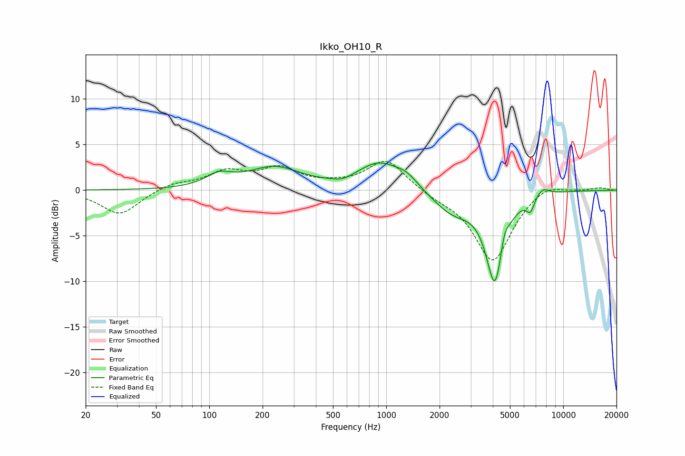

# Ikko_OH10_R
See [usage instructions](https://github.com/jaakkopasanen/AutoEq#usage) for more options and info.

### Parametric EQs
Apply preamp of -3.1 dB when using parametric equalizer.

|   # | Type    |   Fc (Hz) |    Q |   Gain (dB) |
|-----|---------|-----------|------|-------------|
|   1 | Peaking |       114 | 1.88 |         1.3 |
|   2 | Peaking |       232 | 0.97 |         2.4 |
|   3 | Peaking |       568 | 2.55 |        -0.4 |
|   4 | Peaking |       917 | 1.13 |         3   |
|   5 | Peaking |      1309 | 2.3  |         1   |
|   6 | Peaking |      2372 | 1.25 |        -2.4 |
|   7 | Peaking |      4116 | 2.77 |        -9.9 |
|   8 | Peaking |      4636 | 6    |         1.8 |
|   9 | Peaking |      6524 | 6    |        -1.5 |
|  10 | Peaking |      7623 | 3.5  |         0.9 |

### Fixed Band EQs
When using fixed band (also called graphic) equalizer, apply preamp of **-3.3 dB** (if available) and set gains manually with these parameters.

|   # | Type    |   Fc (Hz) |    Q |   Gain (dB) |
|-----|---------|-----------|------|-------------|
|   1 | Peaking |        31 | 1.41 |        -2.7 |
|   2 | Peaking |        62 | 1.41 |         0.7 |
|   3 | Peaking |       125 | 1.41 |         1.9 |
|   4 | Peaking |       250 | 1.41 |         2.2 |
|   5 | Peaking |       500 | 1.41 |         0.4 |
|   6 | Peaking |      1000 | 1.41 |         3.4 |
|   7 | Peaking |      2000 | 1.41 |        -0.6 |
|   8 | Peaking |      4000 | 1.41 |        -7.8 |
|   9 | Peaking |      8000 | 1.41 |         1   |
|  10 | Peaking |     16000 | 1.41 |         0.3 |

### Graphs

