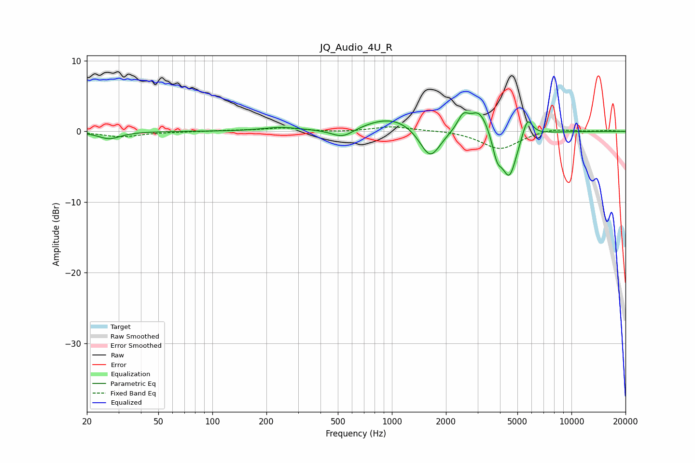

# JQ_Audio_4U_R
See [usage instructions](https://github.com/jaakkopasanen/AutoEq#usage) for more options and info.

### Parametric EQs
Apply preamp of -2.7 dB when using parametric equalizer.

|   # | Type    |   Fc (Hz) |    Q |   Gain (dB) |
|-----|---------|-----------|------|-------------|
|   1 | Peaking |        27 | 2.31 |        -1   |
|   2 | Peaking |       240 | 1.37 |         0.5 |
|   3 | Peaking |       532 | 2.18 |        -1.4 |
|   4 | Peaking |      1003 | 0.93 |         2.2 |
|   5 | Peaking |      1633 | 2.41 |        -4.5 |
|   6 | Peaking |      2489 | 4.77 |         1.9 |
|   7 | Peaking |      3074 | 2.61 |         3.3 |
|   8 | Peaking |      3851 | 5.32 |        -3   |
|   9 | Peaking |      4508 | 3.29 |        -6.5 |
|  10 | Peaking |      5680 | 4.83 |         2.9 |

### Fixed Band EQs
When using fixed band (also called graphic) equalizer, apply preamp of **-0.7 dB** (if available) and set gains manually with these parameters.

|   # | Type    |   Fc (Hz) |    Q |   Gain (dB) |
|-----|---------|-----------|------|-------------|
|   1 | Peaking |        31 | 1.41 |        -0.8 |
|   2 | Peaking |        62 | 1.41 |        -0   |
|   3 | Peaking |       125 | 1.41 |         0.1 |
|   4 | Peaking |       250 | 1.41 |         0.5 |
|   5 | Peaking |       500 | 1.41 |        -0.1 |
|   6 | Peaking |      1000 | 1.41 |         0.7 |
|   7 | Peaking |      2000 | 1.41 |         0.2 |
|   8 | Peaking |      4000 | 1.41 |        -2.5 |
|   9 | Peaking |      8000 | 1.41 |         0.5 |
|  10 | Peaking |     16000 | 1.41 |         0.1 |

### Graphs

