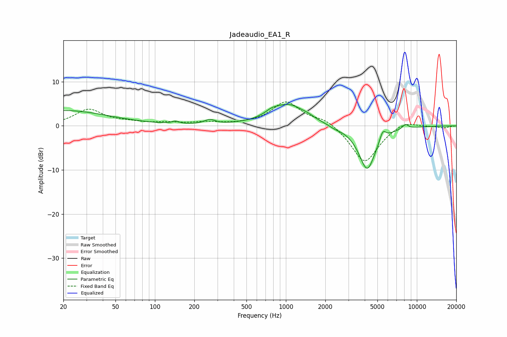

# Jadeaudio_EA1_R
See [usage instructions](https://github.com/jaakkopasanen/AutoEq#usage) for more options and info.

### Parametric EQs
Apply preamp of -5.0 dB when using parametric equalizer.

|   # | Type    |   Fc (Hz) |    Q |   Gain (dB) |
|-----|---------|-----------|------|-------------|
|   1 | Peaking |        20 | 0.41 |         3.5 |
|   2 | Peaking |       143 | 5.89 |         0.6 |
|   3 | Peaking |       262 | 3.55 |         1   |
|   4 | Peaking |       776 | 3.04 |         0.8 |
|   5 | Peaking |      1046 | 1.07 |         4.8 |
|   6 | Peaking |      1475 | 3.58 |         0.3 |
|   7 | Peaking |      2366 | 3.21 |        -0.4 |
|   8 | Peaking |      4174 | 2.12 |       -10   |
|   9 | Peaking |      5490 | 6    |         2.3 |
|  10 | Peaking |      8179 | 5.97 |         1   |

### Fixed Band EQs
When using fixed band (also called graphic) equalizer, apply preamp of **-5.5 dB** (if available) and set gains manually with these parameters.

|   # | Type    |   Fc (Hz) |    Q |   Gain (dB) |
|-----|---------|-----------|------|-------------|
|   1 | Peaking |        31 | 1.41 |         3.6 |
|   2 | Peaking |        62 | 1.41 |         0.6 |
|   3 | Peaking |       125 | 1.41 |         0.6 |
|   4 | Peaking |       250 | 1.41 |         0.7 |
|   5 | Peaking |       500 | 1.41 |         0.2 |
|   6 | Peaking |      1000 | 1.41 |         5.4 |
|   7 | Peaking |      2000 | 1.41 |         1.7 |
|   8 | Peaking |      4000 | 1.41 |        -8.6 |
|   9 | Peaking |      8000 | 1.41 |         1.4 |
|  10 | Peaking |     16000 | 1.41 |        -0.5 |

### Graphs

