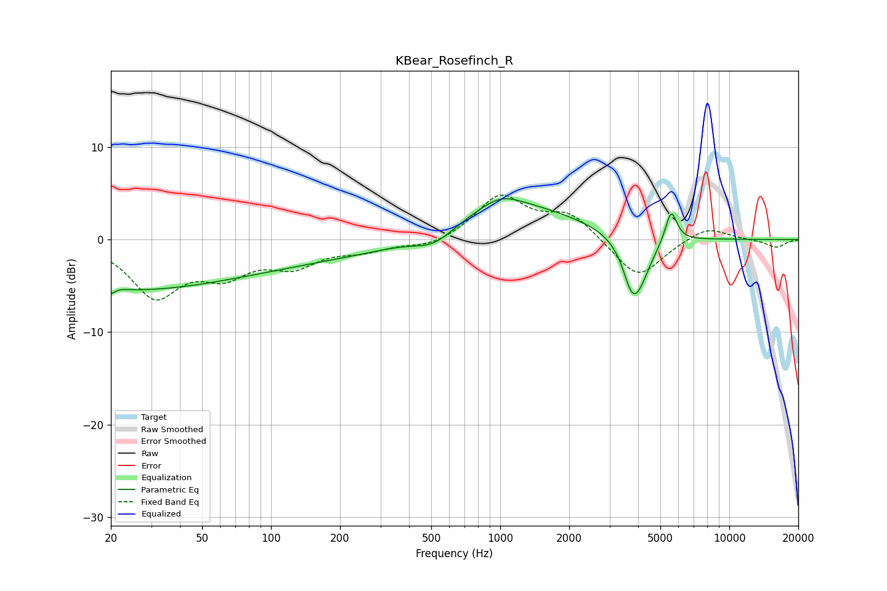

# KBear_Rosefinch_R
See [usage instructions](https://github.com/jaakkopasanen/AutoEq#usage) for more options and info.

### Parametric EQs
Apply preamp of -4.5 dB when using parametric equalizer.

|   # | Type    |   Fc (Hz) |    Q |   Gain (dB) |
|-----|---------|-----------|------|-------------|
|   1 | Peaking |        20 | 0.25 |        -5.3 |
|   2 | Peaking |        20 | 5.03 |         3.7 |
|   3 | Peaking |        20 | 5.77 |        -4   |
|   4 | Peaking |       200 | 0.33 |        -1.7 |
|   5 | Peaking |       515 | 1.56 |        -1.8 |
|   6 | Peaking |      1008 | 1.66 |         1.3 |
|   7 | Peaking |      1078 | 0.46 |         4   |
|   8 | Peaking |      3718 | 4.63 |        -1.8 |
|   9 | Peaking |      3961 | 2.53 |        -5.7 |
|  10 | Peaking |      5573 | 5.42 |         3.5 |

### Fixed Band EQs
When using fixed band (also called graphic) equalizer, apply preamp of **-4.9 dB** (if available) and set gains manually with these parameters.

|   # | Type    |   Fc (Hz) |    Q |   Gain (dB) |
|-----|---------|-----------|------|-------------|
|   1 | Peaking |        31 | 1.41 |        -5.8 |
|   2 | Peaking |        62 | 1.41 |        -3.1 |
|   3 | Peaking |       125 | 1.41 |        -2.5 |
|   4 | Peaking |       250 | 1.41 |        -1   |
|   5 | Peaking |       500 | 1.41 |        -0.9 |
|   6 | Peaking |      1000 | 1.41 |         4.7 |
|   7 | Peaking |      2000 | 1.41 |         2.7 |
|   8 | Peaking |      4000 | 1.41 |        -4.3 |
|   9 | Peaking |      8000 | 1.41 |         1.5 |
|  10 | Peaking |     16000 | 1.41 |        -0.9 |

### Graphs

