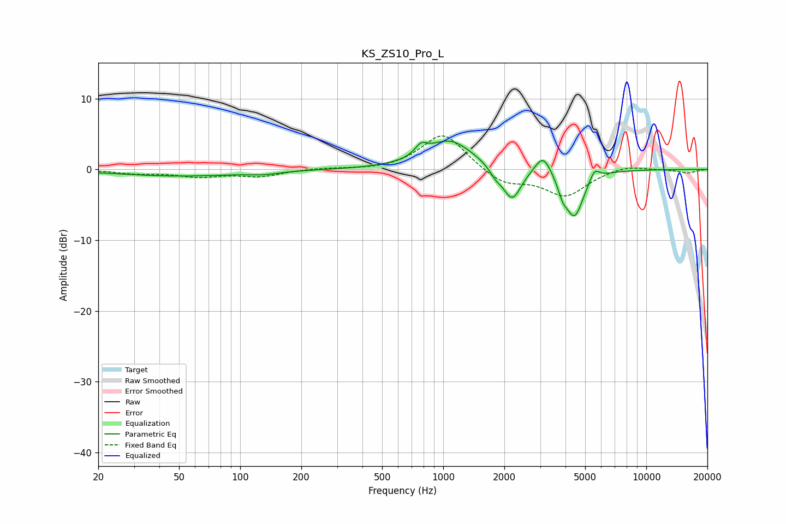

# KS_ZS10_Pro_L
See [usage instructions](https://github.com/jaakkopasanen/AutoEq#usage) for more options and info.

### Parametric EQs
Apply preamp of -4.1 dB when using parametric equalizer.

|   # | Type    |   Fc (Hz) |    Q |   Gain (dB) |
|-----|---------|-----------|------|-------------|
|   1 | Peaking |        50 | 0.46 |        -0.9 |
|   2 | Peaking |       131 | 1.95 |        -0.3 |
|   3 | Peaking |       778 | 4.91 |         1.4 |
|   4 | Peaking |      1076 | 1.22 |         4.1 |
|   5 | Peaking |      1810 | 4.87 |        -1   |
|   6 | Peaking |      2183 | 3.1  |        -4.7 |
|   7 | Peaking |      3102 | 3.55 |         2.9 |
|   8 | Peaking |      3871 | 6    |        -1.7 |
|   9 | Peaking |      4430 | 3.08 |        -6.6 |
|  10 | Peaking |      5556 | 5.98 |         1.6 |

### Fixed Band EQs
When using fixed band (also called graphic) equalizer, apply preamp of **-4.8 dB** (if available) and set gains manually with these parameters.

|   # | Type    |   Fc (Hz) |    Q |   Gain (dB) |
|-----|---------|-----------|------|-------------|
|   1 | Peaking |        31 | 1.41 |        -0.5 |
|   2 | Peaking |        62 | 1.41 |        -0.9 |
|   3 | Peaking |       125 | 1.41 |        -0.9 |
|   4 | Peaking |       250 | 1.41 |         0.2 |
|   5 | Peaking |       500 | 1.41 |        -0.2 |
|   6 | Peaking |      1000 | 1.41 |         5.2 |
|   7 | Peaking |      2000 | 1.41 |        -2.1 |
|   8 | Peaking |      4000 | 1.41 |        -3.7 |
|   9 | Peaking |      8000 | 1.41 |         0.7 |
|  10 | Peaking |     16000 | 1.41 |        -0.5 |

### Graphs

