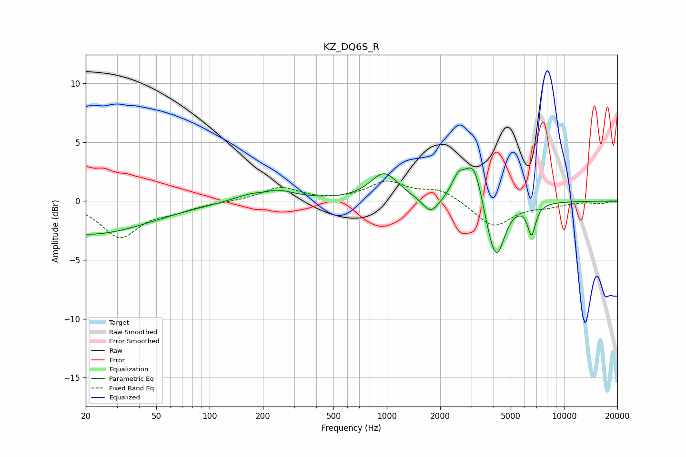

# KZ_DQ6S_R
See [usage instructions](https://github.com/jaakkopasanen/AutoEq#usage) for more options and info.

### Parametric EQs
Apply preamp of -2.9 dB when using parametric equalizer.

|   # | Type    |   Fc (Hz) |    Q |   Gain (dB) |
|-----|---------|-----------|------|-------------|
|   1 | Peaking |        20 | 0.4  |        -2.8 |
|   2 | Peaking |       203 | 2.38 |        -0.6 |
|   3 | Peaking |       209 | 1.26 |         1.6 |
|   4 | Peaking |       968 | 1.81 |         2.3 |
|   5 | Peaking |      1772 | 3.03 |        -1.4 |
|   6 | Peaking |      2530 | 3.87 |         1.6 |
|   7 | Peaking |      3106 | 2.73 |         3.7 |
|   8 | Peaking |      3768 | 2.92 |        -1.4 |
|   9 | Peaking |      4174 | 3.01 |        -4.3 |
|  10 | Peaking |      6561 | 6    |        -2.6 |

### Fixed Band EQs
When using fixed band (also called graphic) equalizer, apply preamp of **-1.8 dB** (if available) and set gains manually with these parameters.

|   # | Type    |   Fc (Hz) |    Q |   Gain (dB) |
|-----|---------|-----------|------|-------------|
|   1 | Peaking |        31 | 1.41 |        -3   |
|   2 | Peaking |        62 | 1.41 |        -0.7 |
|   3 | Peaking |       125 | 1.41 |        -0.1 |
|   4 | Peaking |       250 | 1.41 |         1.2 |
|   5 | Peaking |       500 | 1.41 |        -0   |
|   6 | Peaking |      1000 | 1.41 |         1.6 |
|   7 | Peaking |      2000 | 1.41 |         1   |
|   8 | Peaking |      4000 | 1.41 |        -2.2 |
|   9 | Peaking |      8000 | 1.41 |        -0.4 |
|  10 | Peaking |     16000 | 1.41 |        -0.2 |

### Graphs

