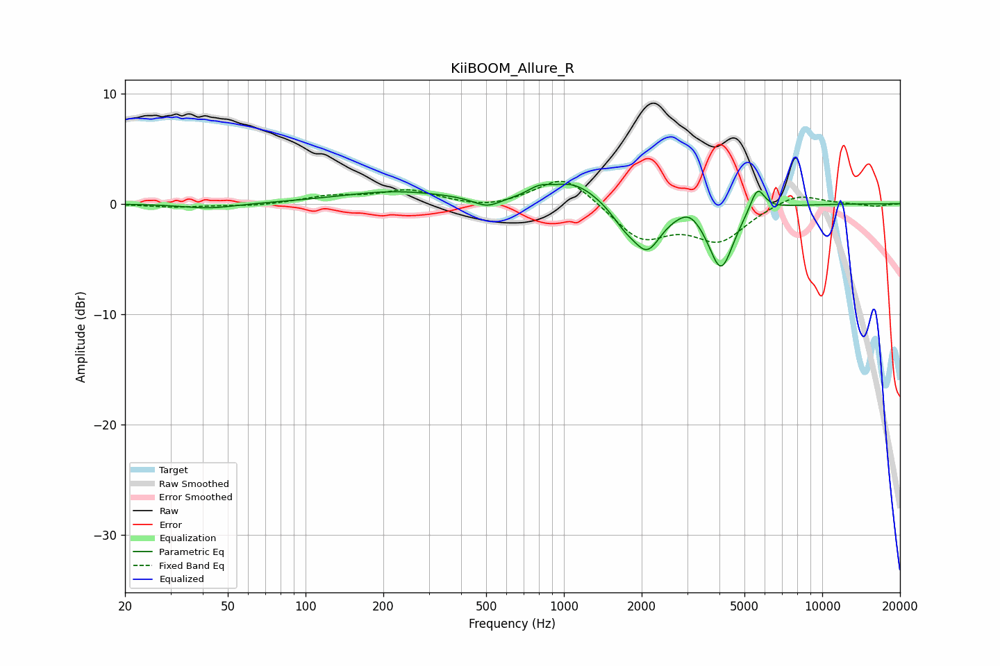

# KiiBOOM_Allure_R
See [usage instructions](https://github.com/jaakkopasanen/AutoEq#usage) for more options and info.

### Parametric EQs
Apply preamp of -1.9 dB when using parametric equalizer.

|   # | Type    |   Fc (Hz) |    Q |   Gain (dB) |
|-----|---------|-----------|------|-------------|
|   1 | Peaking |        42 | 1.35 |        -0.5 |
|   2 | Peaking |       223 | 0.65 |         1.1 |
|   3 | Peaking |       504 | 2.73 |        -0.9 |
|   4 | Peaking |       802 | 3.13 |         0.7 |
|   5 | Peaking |      1093 | 1.47 |         1.9 |
|   6 | Peaking |      1715 | 2.77 |        -1.3 |
|   7 | Peaking |      2100 | 2.56 |        -3.8 |
|   8 | Peaking |      3065 | 3.24 |         0.9 |
|   9 | Peaking |      4057 | 2.89 |        -5.8 |
|  10 | Peaking |      5610 | 4.93 |         2.3 |

### Fixed Band EQs
When using fixed band (also called graphic) equalizer, apply preamp of **-2.1 dB** (if available) and set gains manually with these parameters.

|   # | Type    |   Fc (Hz) |    Q |   Gain (dB) |
|-----|---------|-----------|------|-------------|
|   1 | Peaking |        31 | 1.41 |        -0.3 |
|   2 | Peaking |        62 | 1.41 |        -0.2 |
|   3 | Peaking |       125 | 1.41 |         0.6 |
|   4 | Peaking |       250 | 1.41 |         1.2 |
|   5 | Peaking |       500 | 1.41 |        -0.5 |
|   6 | Peaking |      1000 | 1.41 |         2.7 |
|   7 | Peaking |      2000 | 1.41 |        -3.1 |
|   8 | Peaking |      4000 | 1.41 |        -3.2 |
|   9 | Peaking |      8000 | 1.41 |         1.1 |
|  10 | Peaking |     16000 | 1.41 |        -0.2 |

### Graphs

