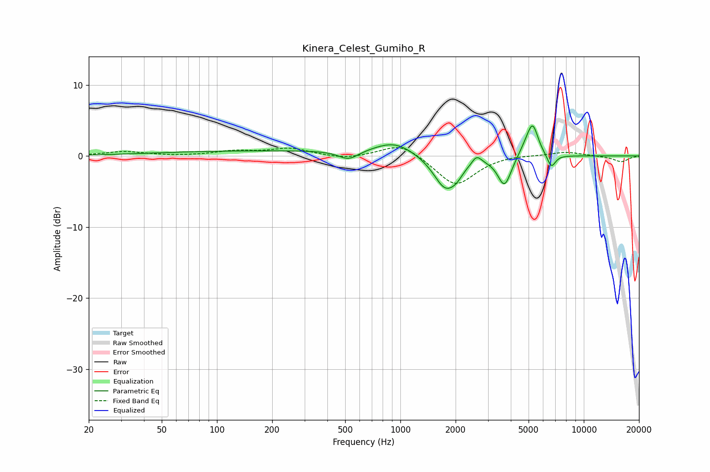

# Kinera_Celest_Gumiho_R
See [usage instructions](https://github.com/jaakkopasanen/AutoEq#usage) for more options and info.

### Parametric EQs
Apply preamp of -4.3 dB when using parametric equalizer.

|   # | Type    |   Fc (Hz) |    Q |   Gain (dB) |
|-----|---------|-----------|------|-------------|
|   1 | Peaking |       223 | 0.18 |         0.7 |
|   2 | Peaking |       522 | 2.53 |        -1.3 |
|   3 | Peaking |       929 | 1.35 |         1.7 |
|   4 | Peaking |      1769 | 2.12 |        -4.8 |
|   5 | Peaking |      2033 | 4.56 |        -0.7 |
|   6 | Peaking |      2604 | 5.49 |         1.2 |
|   7 | Peaking |      3698 | 3.81 |        -4.2 |
|   8 | Peaking |      4885 | 3.34 |         1.4 |
|   9 | Peaking |      5275 | 4.72 |         3.9 |
|  10 | Peaking |      6653 | 6    |        -1.9 |

### Fixed Band EQs
When using fixed band (also called graphic) equalizer, apply preamp of **-1.3 dB** (if available) and set gains manually with these parameters.

|   # | Type    |   Fc (Hz) |    Q |   Gain (dB) |
|-----|---------|-----------|------|-------------|
|   1 | Peaking |        31 | 1.41 |         0.6 |
|   2 | Peaking |        62 | 1.41 |        -0   |
|   3 | Peaking |       125 | 1.41 |         0.6 |
|   4 | Peaking |       250 | 1.41 |         1   |
|   5 | Peaking |       500 | 1.41 |        -0.5 |
|   6 | Peaking |      1000 | 1.41 |         1.9 |
|   7 | Peaking |      2000 | 1.41 |        -4.2 |
|   8 | Peaking |      4000 | 1.41 |         0.2 |
|   9 | Peaking |      8000 | 1.41 |         0.6 |
|  10 | Peaking |     16000 | 1.41 |        -0.8 |

### Graphs

