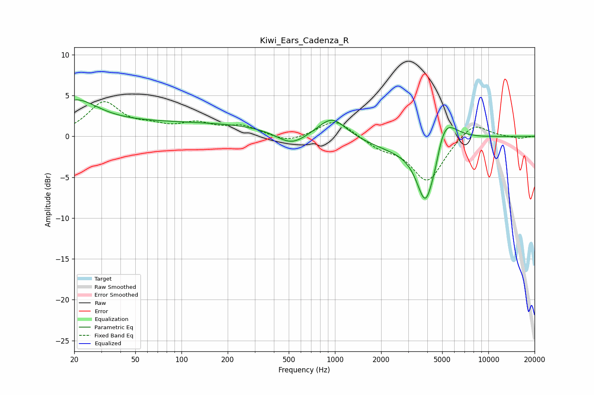

# Kiwi_Ears_Cadenza_R
See [usage instructions](https://github.com/jaakkopasanen/AutoEq#usage) for more options and info.

### Parametric EQs
Apply preamp of -4.6 dB when using parametric equalizer.

|   # | Type    |   Fc (Hz) |    Q |   Gain (dB) |
|-----|---------|-----------|------|-------------|
|   1 | Peaking |        20 | 0.98 |         3.5 |
|   2 | Peaking |        96 | 0.18 |         1.6 |
|   3 | Peaking |       520 | 1.42 |        -1.8 |
|   4 | Peaking |       959 | 1.6  |         2.5 |
|   5 | Peaking |      2552 | 0.67 |        -1.5 |
|   6 | Peaking |      3909 | 2.34 |        -8.3 |
|   7 | Peaking |      4503 | 4.71 |        -1.1 |
|   8 | Peaking |      5074 | 1.64 |         3.5 |
|   9 | Peaking |      5210 | 2.69 |         0.8 |
|  10 | Peaking |      8991 | 6    |        -0   |

### Fixed Band EQs
When using fixed band (also called graphic) equalizer, apply preamp of **-4.3 dB** (if available) and set gains manually with these parameters.

|   # | Type    |   Fc (Hz) |    Q |   Gain (dB) |
|-----|---------|-----------|------|-------------|
|   1 | Peaking |        31 | 1.41 |         4   |
|   2 | Peaking |        62 | 1.41 |         0.9 |
|   3 | Peaking |       125 | 1.41 |         1.4 |
|   4 | Peaking |       250 | 1.41 |         1.1 |
|   5 | Peaking |       500 | 1.41 |        -0.9 |
|   6 | Peaking |      1000 | 1.41 |         2.2 |
|   7 | Peaking |      2000 | 1.41 |        -1.2 |
|   8 | Peaking |      4000 | 1.41 |        -5.5 |
|   9 | Peaking |      8000 | 1.41 |         1.9 |
|  10 | Peaking |     16000 | 1.41 |        -0.3 |

### Graphs

