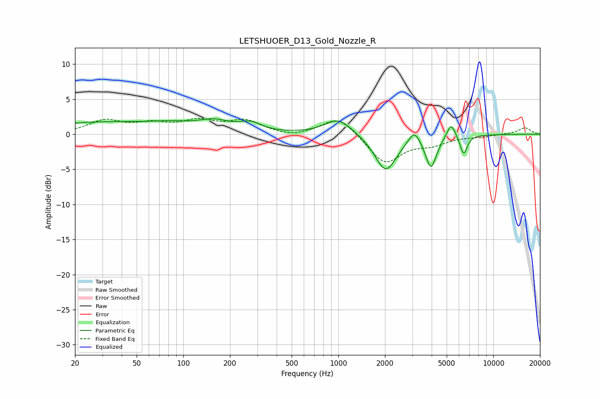

# LETSHUOER_D13_Gold_Nozzle_R
See [usage instructions](https://github.com/jaakkopasanen/AutoEq#usage) for more options and info.

### Parametric EQs
Apply preamp of -2.3 dB when using parametric equalizer.

|   # | Type    |   Fc (Hz) |    Q |   Gain (dB) |
|-----|---------|-----------|------|-------------|
|   1 | Peaking |        28 | 0.38 |         1.6 |
|   2 | Peaking |        85 | 0.93 |         0.8 |
|   3 | Peaking |       158 | 1.38 |         1.4 |
|   4 | Peaking |       271 | 1.95 |         1.2 |
|   5 | Peaking |      1002 | 1.59 |         2.3 |
|   6 | Peaking |      2022 | 2    |        -5.3 |
|   7 | Peaking |      3089 | 3.89 |         1.9 |
|   8 | Peaking |      3961 | 4.01 |        -4.6 |
|   9 | Peaking |      5338 | 5.2  |         2.2 |
|  10 | Peaking |      6435 | 6    |        -2.8 |

### Fixed Band EQs
When using fixed band (also called graphic) equalizer, apply preamp of **-2.4 dB** (if available) and set gains manually with these parameters.

|   # | Type    |   Fc (Hz) |    Q |   Gain (dB) |
|-----|---------|-----------|------|-------------|
|   1 | Peaking |        31 | 1.41 |         1.8 |
|   2 | Peaking |        62 | 1.41 |         1.2 |
|   3 | Peaking |       125 | 1.41 |         1.7 |
|   4 | Peaking |       250 | 1.41 |         1.8 |
|   5 | Peaking |       500 | 1.41 |        -0.5 |
|   6 | Peaking |      1000 | 1.41 |         2.7 |
|   7 | Peaking |      2000 | 1.41 |        -4.2 |
|   8 | Peaking |      4000 | 1.41 |        -1.2 |
|   9 | Peaking |      8000 | 1.41 |        -0.3 |
|  10 | Peaking |     16000 | 1.41 |         0.9 |

### Graphs

