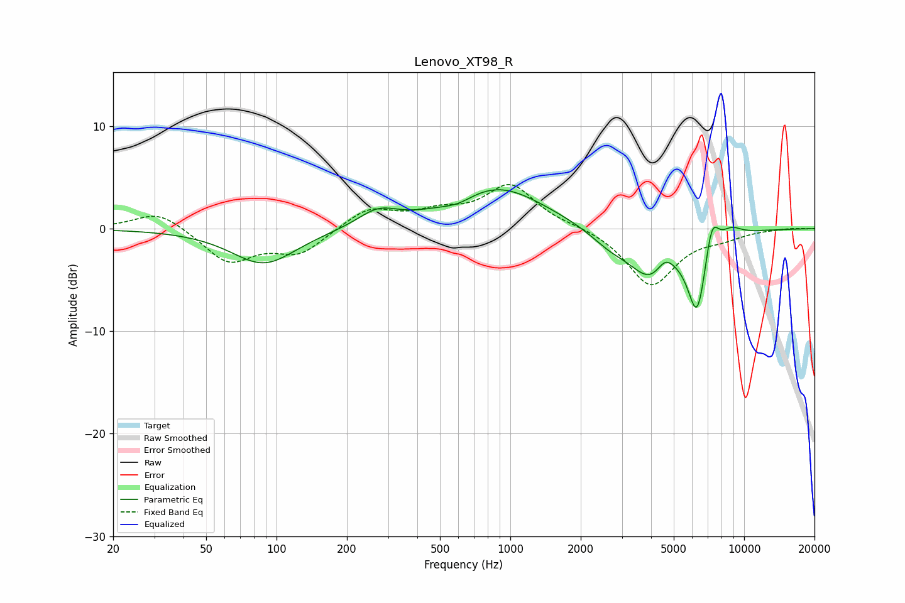

# Lenovo_XT98_R
See [usage instructions](https://github.com/jaakkopasanen/AutoEq#usage) for more options and info.

### Parametric EQs
Apply preamp of -3.9 dB when using parametric equalizer.

|   # | Type    |   Fc (Hz) |    Q |   Gain (dB) |
|-----|---------|-----------|------|-------------|
|   1 | Peaking |        88 | 1.02 |        -3.5 |
|   2 | Peaking |       271 | 1.66 |         1.6 |
|   3 | Peaking |       596 | 2.13 |        -0.7 |
|   4 | Peaking |       881 | 0.7  |         4.1 |
|   5 | Peaking |      2677 | 1.57 |        -1.4 |
|   6 | Peaking |      4015 | 1.51 |        -4.5 |
|   7 | Peaking |      4586 | 3.55 |         1.6 |
|   8 | Peaking |      6308 | 3.28 |        -7.7 |
|   9 | Peaking |      7260 | 4.61 |         3.6 |
|  10 | Peaking |      8814 | 2.98 |         0.9 |

### Fixed Band EQs
When using fixed band (also called graphic) equalizer, apply preamp of **-4.4 dB** (if available) and set gains manually with these parameters.

|   # | Type    |   Fc (Hz) |    Q |   Gain (dB) |
|-----|---------|-----------|------|-------------|
|   1 | Peaking |        31 | 1.41 |         1.8 |
|   2 | Peaking |        62 | 1.41 |        -3.2 |
|   3 | Peaking |       125 | 1.41 |        -2.3 |
|   4 | Peaking |       250 | 1.41 |         2   |
|   5 | Peaking |       500 | 1.41 |         1.3 |
|   6 | Peaking |      1000 | 1.41 |         4.2 |
|   7 | Peaking |      2000 | 1.41 |         0.2 |
|   8 | Peaking |      4000 | 1.41 |        -5.6 |
|   9 | Peaking |      8000 | 1.41 |        -0.7 |
|  10 | Peaking |     16000 | 1.41 |         0.1 |

### Graphs

