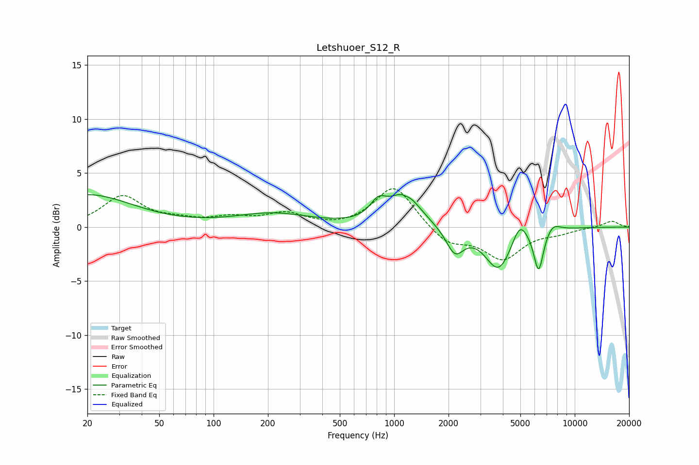

# Letshuoer_S12_R
See [usage instructions](https://github.com/jaakkopasanen/AutoEq#usage) for more options and info.

### Parametric EQs
Apply preamp of -3.1 dB when using parametric equalizer.

|   # | Type    |   Fc (Hz) |    Q |   Gain (dB) |
|-----|---------|-----------|------|-------------|
|   1 | Peaking |        20 | 0.57 |         3   |
|   2 | Peaking |       213 | 0.68 |         1.2 |
|   3 | Peaking |       817 | 3.1  |         1.5 |
|   4 | Peaking |      1147 | 1.69 |         3   |
|   5 | Peaking |      1163 | 5.96 |        -0.2 |
|   6 | Peaking |      2170 | 2.9  |        -2.4 |
|   7 | Peaking |      3786 | 1.9  |        -4   |
|   8 | Peaking |      4959 | 3.39 |         1.9 |
|   9 | Peaking |      6309 | 5.14 |        -3.9 |
|  10 | Peaking |      7566 | 3.4  |         0.8 |

### Fixed Band EQs
When using fixed band (also called graphic) equalizer, apply preamp of **-3.6 dB** (if available) and set gains manually with these parameters.

|   # | Type    |   Fc (Hz) |    Q |   Gain (dB) |
|-----|---------|-----------|------|-------------|
|   1 | Peaking |        31 | 1.41 |         2.8 |
|   2 | Peaking |        62 | 1.41 |         0.5 |
|   3 | Peaking |       125 | 1.41 |         0.7 |
|   4 | Peaking |       250 | 1.41 |         1.2 |
|   5 | Peaking |       500 | 1.41 |        -0.1 |
|   6 | Peaking |      1000 | 1.41 |         3.9 |
|   7 | Peaking |      2000 | 1.41 |        -1.6 |
|   8 | Peaking |      4000 | 1.41 |        -2.8 |
|   9 | Peaking |      8000 | 1.41 |        -0.4 |
|  10 | Peaking |     16000 | 1.41 |         0.6 |

### Graphs

