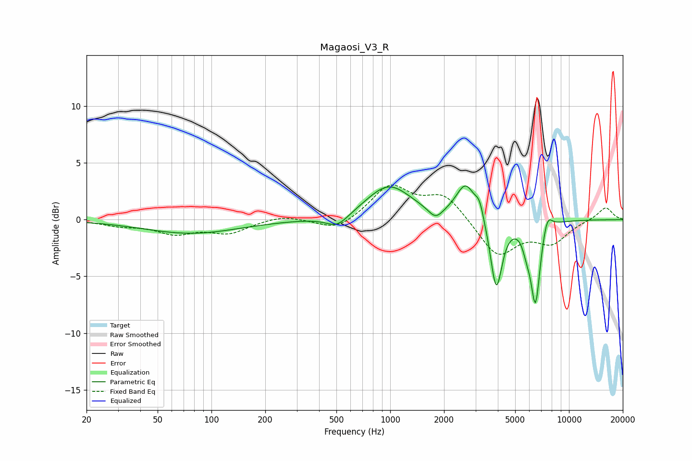

# Magaosi_V3_R
See [usage instructions](https://github.com/jaakkopasanen/AutoEq#usage) for more options and info.

### Parametric EQs
Apply preamp of -3.1 dB when using parametric equalizer.

|   # | Type    |   Fc (Hz) |    Q |   Gain (dB) |
|-----|---------|-----------|------|-------------|
|   1 | Peaking |        77 | 0.53 |        -1.2 |
|   2 | Peaking |       507 | 2.18 |        -1.1 |
|   3 | Peaking |       982 | 1.13 |         3   |
|   4 | Peaking |      1795 | 3.47 |        -1   |
|   5 | Peaking |      2644 | 2.64 |         3   |
|   6 | Peaking |      3161 | 5.99 |         1.3 |
|   7 | Peaking |      3920 | 4.32 |        -6.3 |
|   8 | Peaking |      5798 | 5.99 |        -1.2 |
|   9 | Peaking |      6494 | 5.13 |        -7.2 |
|  10 | Peaking |      7560 | 5.04 |         1.5 |

### Fixed Band EQs
When using fixed band (also called graphic) equalizer, apply preamp of **-3.1 dB** (if available) and set gains manually with these parameters.

|   # | Type    |   Fc (Hz) |    Q |   Gain (dB) |
|-----|---------|-----------|------|-------------|
|   1 | Peaking |        31 | 1.41 |        -0.4 |
|   2 | Peaking |        62 | 1.41 |        -1.1 |
|   3 | Peaking |       125 | 1.41 |        -1.1 |
|   4 | Peaking |       250 | 1.41 |         0.4 |
|   5 | Peaking |       500 | 1.41 |        -1.1 |
|   6 | Peaking |      1000 | 1.41 |         2.9 |
|   7 | Peaking |      2000 | 1.41 |         2.2 |
|   8 | Peaking |      4000 | 1.41 |        -3.2 |
|   9 | Peaking |      8000 | 1.41 |        -1.9 |
|  10 | Peaking |     16000 | 1.41 |         1.1 |

### Graphs

