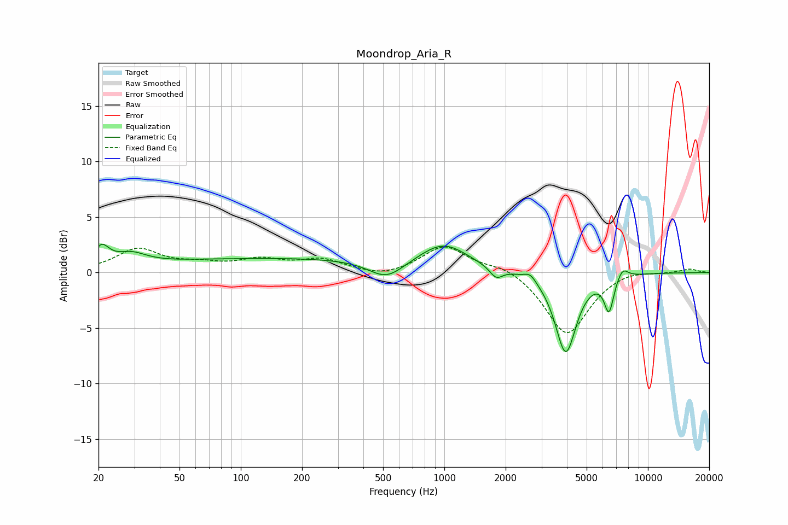

# Moondrop_Aria_R
See [usage instructions](https://github.com/jaakkopasanen/AutoEq#usage) for more options and info.

### Parametric EQs
Apply preamp of -2.6 dB when using parametric equalizer.

|   # | Type    |   Fc (Hz) |    Q |   Gain (dB) |
|-----|---------|-----------|------|-------------|
|   1 | Peaking |        21 | 3.93 |         1.7 |
|   2 | Peaking |        29 | 1.86 |         1   |
|   3 | Peaking |       160 | 0.18 |         1.3 |
|   4 | Peaking |       520 | 1.6  |        -1.7 |
|   5 | Peaking |       996 | 1.22 |         2.2 |
|   6 | Peaking |      1798 | 4.51 |        -1   |
|   7 | Peaking |      2643 | 4.91 |         0.7 |
|   8 | Peaking |      3947 | 2.72 |        -7.2 |
|   9 | Peaking |      6440 | 5.93 |        -3.1 |
|  10 | Peaking |      7502 | 4.88 |         1   |

### Fixed Band EQs
When using fixed band (also called graphic) equalizer, apply preamp of **-2.4 dB** (if available) and set gains manually with these parameters.

|   # | Type    |   Fc (Hz) |    Q |   Gain (dB) |
|-----|---------|-----------|------|-------------|
|   1 | Peaking |        31 | 1.41 |         2   |
|   2 | Peaking |        62 | 1.41 |         0.6 |
|   3 | Peaking |       125 | 1.41 |         1   |
|   4 | Peaking |       250 | 1.41 |         1.1 |
|   5 | Peaking |       500 | 1.41 |        -0.5 |
|   6 | Peaking |      1000 | 1.41 |         2.4 |
|   7 | Peaking |      2000 | 1.41 |         0.7 |
|   8 | Peaking |      4000 | 1.41 |        -5.7 |
|   9 | Peaking |      8000 | 1.41 |         0.4 |
|  10 | Peaking |     16000 | 1.41 |         0.3 |

### Graphs

