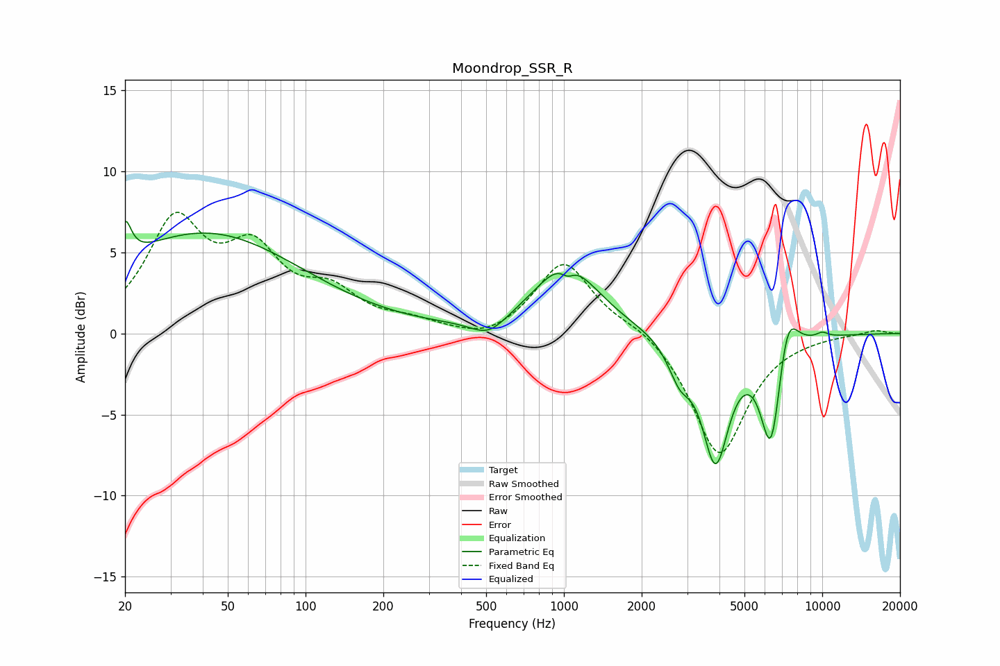

# Moondrop_SSR_R
See [usage instructions](https://github.com/jaakkopasanen/AutoEq#usage) for more options and info.

### Parametric EQs
Apply preamp of -7.0 dB when using parametric equalizer.

|   # | Type    |   Fc (Hz) |    Q |   Gain (dB) |
|-----|---------|-----------|------|-------------|
|   1 | Peaking |        20 | 5.97 |         2.3 |
|   2 | Peaking |        41 | 0.37 |         6.2 |
|   3 | Peaking |       511 | 2.04 |        -1.1 |
|   4 | Peaking |      1021 | 1.15 |         4.2 |
|   5 | Peaking |      1034 | 5.86 |        -0.5 |
|   6 | Peaking |      2806 | 3.16 |        -2   |
|   7 | Peaking |      3863 | 2.66 |        -7.5 |
|   8 | Peaking |      6343 | 3.31 |        -7.1 |
|   9 | Peaking |      7309 | 3.31 |         3.3 |
|  10 | Peaking |     10000 | 5.28 |         0.3 |

### Fixed Band EQs
When using fixed band (also called graphic) equalizer, apply preamp of **-7.6 dB** (if available) and set gains manually with these parameters.

|   # | Type    |   Fc (Hz) |    Q |   Gain (dB) |
|-----|---------|-----------|------|-------------|
|   1 | Peaking |        31 | 1.41 |         6.6 |
|   2 | Peaking |        62 | 1.41 |         4.4 |
|   3 | Peaking |       125 | 1.41 |         2.1 |
|   4 | Peaking |       250 | 1.41 |         0.6 |
|   5 | Peaking |       500 | 1.41 |        -0.6 |
|   6 | Peaking |      1000 | 1.41 |         4.5 |
|   7 | Peaking |      2000 | 1.41 |         0.6 |
|   8 | Peaking |      4000 | 1.41 |        -7.6 |
|   9 | Peaking |      8000 | 1.41 |        -0.1 |
|  10 | Peaking |     16000 | 1.41 |         0.2 |

### Graphs

