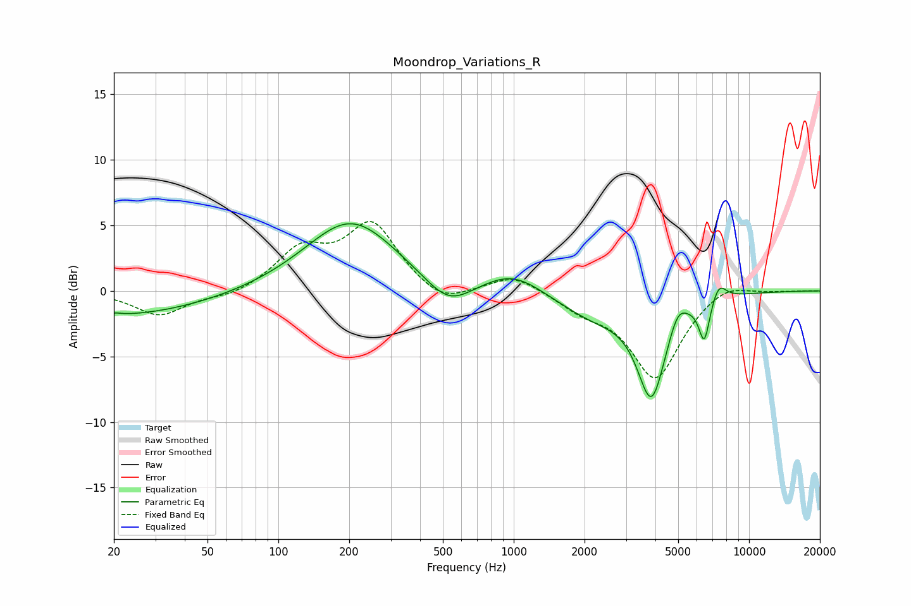

# Moondrop_Variations_R
See [usage instructions](https://github.com/jaakkopasanen/AutoEq#usage) for more options and info.

### Parametric EQs
Apply preamp of -5.2 dB when using parametric equalizer.

|   # | Type    |   Fc (Hz) |    Q |   Gain (dB) |
|-----|---------|-----------|------|-------------|
|   1 | Peaking |        20 | 0.35 |        -1.9 |
|   2 | Peaking |        20 | 5.04 |         0.1 |
|   3 | Peaking |       203 | 0.73 |         5.4 |
|   4 | Peaking |       529 | 1.39 |        -2.1 |
|   5 | Peaking |       996 | 1.11 |         1.6 |
|   6 | Peaking |      2206 | 0.85 |        -1.9 |
|   7 | Peaking |      3849 | 2.32 |        -7.5 |
|   8 | Peaking |      4979 | 3.83 |         1.4 |
|   9 | Peaking |      6455 | 5.92 |        -3.2 |
|  10 | Peaking |      7438 | 4.24 |         1.4 |

### Fixed Band EQs
When using fixed band (also called graphic) equalizer, apply preamp of **-5.4 dB** (if available) and set gains manually with these parameters.

|   # | Type    |   Fc (Hz) |    Q |   Gain (dB) |
|-----|---------|-----------|------|-------------|
|   1 | Peaking |        31 | 1.41 |        -1.9 |
|   2 | Peaking |        62 | 1.41 |        -0.5 |
|   3 | Peaking |       125 | 1.41 |         2.9 |
|   4 | Peaking |       250 | 1.41 |         5   |
|   5 | Peaking |       500 | 1.41 |        -1.3 |
|   6 | Peaking |      1000 | 1.41 |         1.3 |
|   7 | Peaking |      2000 | 1.41 |        -1.2 |
|   8 | Peaking |      4000 | 1.41 |        -6.6 |
|   9 | Peaking |      8000 | 1.41 |         0.9 |
|  10 | Peaking |     16000 | 1.41 |         0   |

### Graphs

