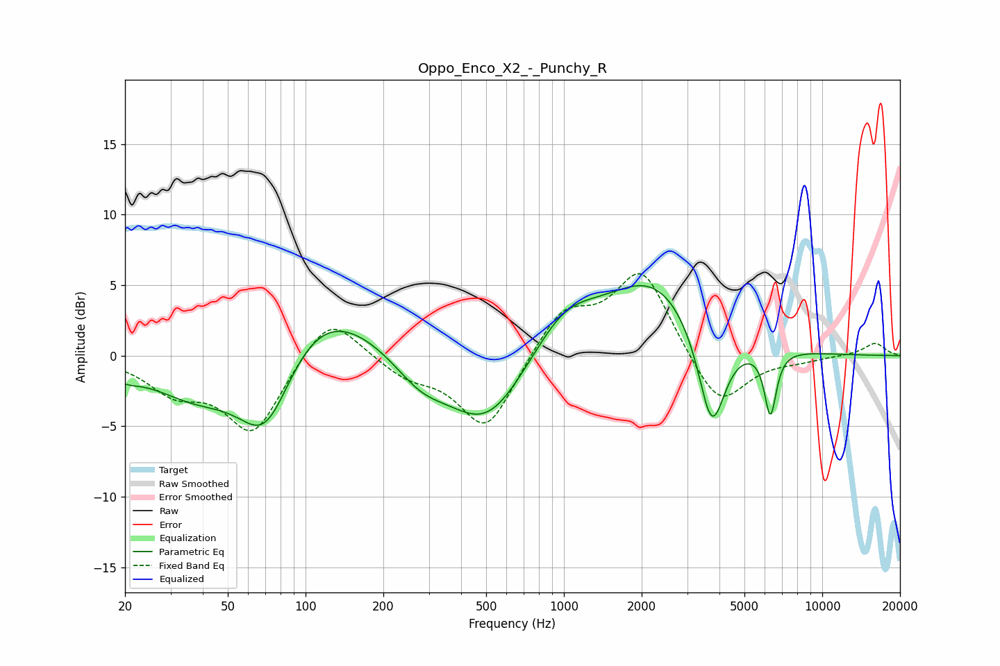

# Oppo_Enco_X2_-_Punchy_R
See [usage instructions](https://github.com/jaakkopasanen/AutoEq#usage) for more options and info.

### Parametric EQs
Apply preamp of -5.1 dB when using parametric equalizer.

|   # | Type    |   Fc (Hz) |    Q |   Gain (dB) |
|-----|---------|-----------|------|-------------|
|   1 | Peaking |        20 | 2.54 |        -0.6 |
|   2 | Peaking |        38 | 0.79 |        -2.9 |
|   3 | Peaking |        70 | 1.26 |        -6.8 |
|   4 | Peaking |       108 | 0.64 |         5   |
|   5 | Peaking |       278 | 1.33 |        -1.9 |
|   6 | Peaking |       502 | 0.91 |        -5.2 |
|   7 | Peaking |      1002 | 1.11 |         3   |
|   8 | Peaking |      2233 | 0.73 |         5.4 |
|   9 | Peaking |      3735 | 2.61 |        -7.5 |
|  10 | Peaking |      6300 | 5.98 |        -4.6 |

### Fixed Band EQs
When using fixed band (also called graphic) equalizer, apply preamp of **-5.9 dB** (if available) and set gains manually with these parameters.

|   # | Type    |   Fc (Hz) |    Q |   Gain (dB) |
|-----|---------|-----------|------|-------------|
|   1 | Peaking |        31 | 1.41 |        -2.2 |
|   2 | Peaking |        62 | 1.41 |        -5.4 |
|   3 | Peaking |       125 | 1.41 |         3.3 |
|   4 | Peaking |       250 | 1.41 |        -1.3 |
|   5 | Peaking |       500 | 1.41 |        -5.3 |
|   6 | Peaking |      1000 | 1.41 |         3.2 |
|   7 | Peaking |      2000 | 1.41 |         6.1 |
|   8 | Peaking |      4000 | 1.41 |        -3.9 |
|   9 | Peaking |      8000 | 1.41 |        -0.3 |
|  10 | Peaking |     16000 | 1.41 |         0.9 |

### Graphs

