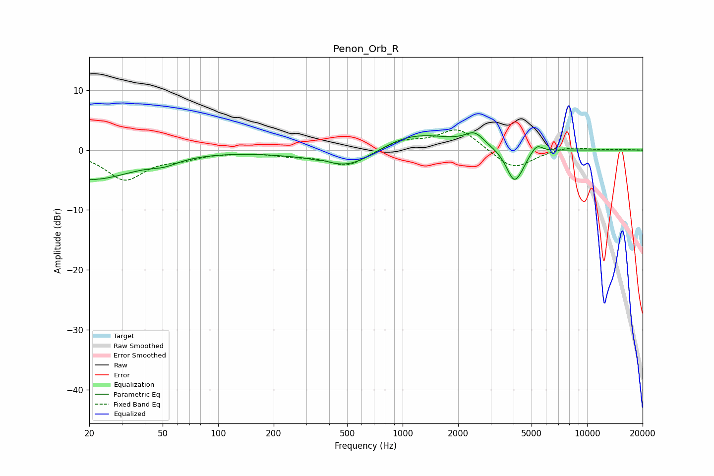

# Penon_Orb_R
See [usage instructions](https://github.com/jaakkopasanen/AutoEq#usage) for more options and info.

### Parametric EQs
Apply preamp of -3.0 dB when using parametric equalizer.

|   # | Type    |   Fc (Hz) |    Q |   Gain (dB) |
|-----|---------|-----------|------|-------------|
|   1 | Peaking |        20 | 0.56 |        -4.9 |
|   2 | Peaking |        51 | 2.02 |        -0.8 |
|   3 | Peaking |       338 | 3.4  |        -0.7 |
|   4 | Peaking |       348 | 2.15 |         1.2 |
|   5 | Peaking |       504 | 0.78 |        -4.2 |
|   6 | Peaking |      1073 | 0.63 |         3.6 |
|   7 | Peaking |      2455 | 2.76 |         2.1 |
|   8 | Peaking |      4027 | 3.22 |        -5.5 |
|   9 | Peaking |      4461 | 6    |        -0.5 |
|  10 | Peaking |      5343 | 4.7  |         1.4 |

### Fixed Band EQs
When using fixed band (also called graphic) equalizer, apply preamp of **-3.4 dB** (if available) and set gains manually with these parameters.

|   # | Type    |   Fc (Hz) |    Q |   Gain (dB) |
|-----|---------|-----------|------|-------------|
|   1 | Peaking |        31 | 1.41 |        -4.8 |
|   2 | Peaking |        62 | 1.41 |        -1.1 |
|   3 | Peaking |       125 | 1.41 |        -0.2 |
|   4 | Peaking |       250 | 1.41 |        -0.7 |
|   5 | Peaking |       500 | 1.41 |        -2.7 |
|   6 | Peaking |      1000 | 1.41 |         1.6 |
|   7 | Peaking |      2000 | 1.41 |         3.7 |
|   8 | Peaking |      4000 | 1.41 |        -3.4 |
|   9 | Peaking |      8000 | 1.41 |         0.7 |
|  10 | Peaking |     16000 | 1.41 |         0.1 |

### Graphs

