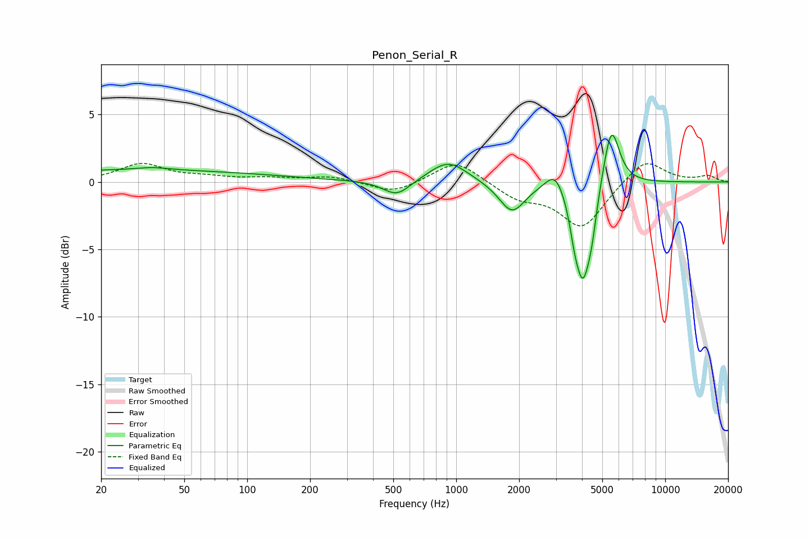

# Penon_Serial_R
See [usage instructions](https://github.com/jaakkopasanen/AutoEq#usage) for more options and info.

### Parametric EQs
Apply preamp of -3.6 dB when using parametric equalizer.

|   # | Type    |   Fc (Hz) |    Q |   Gain (dB) |
|-----|---------|-----------|------|-------------|
|   1 | Peaking |        28 | 0.18 |         0.9 |
|   2 | Peaking |        35 | 1.73 |         0.2 |
|   3 | Peaking |       520 | 2.18 |        -1.2 |
|   4 | Peaking |       917 | 1.56 |         1.6 |
|   5 | Peaking |      1850 | 2.28 |        -2.3 |
|   6 | Peaking |      2977 | 3.13 |         1.5 |
|   7 | Peaking |      3682 | 6    |        -1.4 |
|   8 | Peaking |      4040 | 3.67 |        -6.8 |
|   9 | Peaking |      4461 | 6    |        -1.7 |
|  10 | Peaking |      5524 | 3.6  |         4.6 |

### Fixed Band EQs
When using fixed band (also called graphic) equalizer, apply preamp of **-1.5 dB** (if available) and set gains manually with these parameters.

|   # | Type    |   Fc (Hz) |    Q |   Gain (dB) |
|-----|---------|-----------|------|-------------|
|   1 | Peaking |        31 | 1.41 |         1.3 |
|   2 | Peaking |        62 | 1.41 |         0.3 |
|   3 | Peaking |       125 | 1.41 |         0.2 |
|   4 | Peaking |       250 | 1.41 |         0.4 |
|   5 | Peaking |       500 | 1.41 |        -0.9 |
|   6 | Peaking |      1000 | 1.41 |         1.7 |
|   7 | Peaking |      2000 | 1.41 |        -1.1 |
|   8 | Peaking |      4000 | 1.41 |        -3.4 |
|   9 | Peaking |      8000 | 1.41 |         1.8 |
|  10 | Peaking |     16000 | 1.41 |         0.4 |

### Graphs

