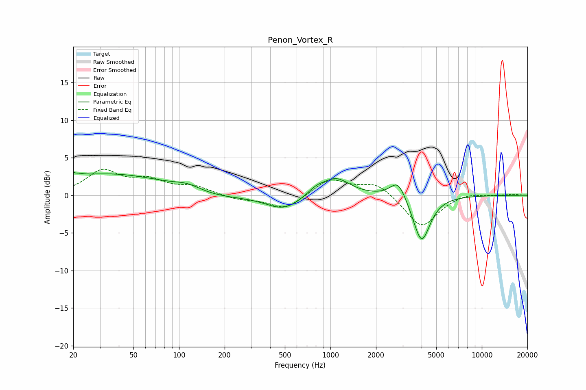

# Penon_Vortex_R
See [usage instructions](https://github.com/jaakkopasanen/AutoEq#usage) for more options and info.

### Parametric EQs
Apply preamp of -3.2 dB when using parametric equalizer.

|   # | Type    |   Fc (Hz) |    Q |   Gain (dB) |
|-----|---------|-----------|------|-------------|
|   1 | Peaking |        20 | 4.95 |         2.8 |
|   2 | Peaking |        20 | 5.94 |        -2.1 |
|   3 | Peaking |        35 | 0.37 |         2.8 |
|   4 | Peaking |       113 | 1.67 |         0.7 |
|   5 | Peaking |       180 | 0.77 |        -0.5 |
|   6 | Peaking |       491 | 1.21 |        -1.9 |
|   7 | Peaking |       801 | 2.45 |         0.8 |
|   8 | Peaking |      1087 | 1.53 |         2.3 |
|   9 | Peaking |      2797 | 2.72 |         2.5 |
|  10 | Peaking |      3995 | 2.5  |        -6.3 |

### Fixed Band EQs
When using fixed band (also called graphic) equalizer, apply preamp of **-3.6 dB** (if available) and set gains manually with these parameters.

|   # | Type    |   Fc (Hz) |    Q |   Gain (dB) |
|-----|---------|-----------|------|-------------|
|   1 | Peaking |        31 | 1.41 |         3.1 |
|   2 | Peaking |        62 | 1.41 |         1.7 |
|   3 | Peaking |       125 | 1.41 |         1.1 |
|   4 | Peaking |       250 | 1.41 |        -0.6 |
|   5 | Peaking |       500 | 1.41 |        -1.9 |
|   6 | Peaking |      1000 | 1.41 |         2.2 |
|   7 | Peaking |      2000 | 1.41 |         1.7 |
|   8 | Peaking |      4000 | 1.41 |        -4.3 |
|   9 | Peaking |      8000 | 1.41 |         0.4 |
|  10 | Peaking |     16000 | 1.41 |         0.1 |

### Graphs

