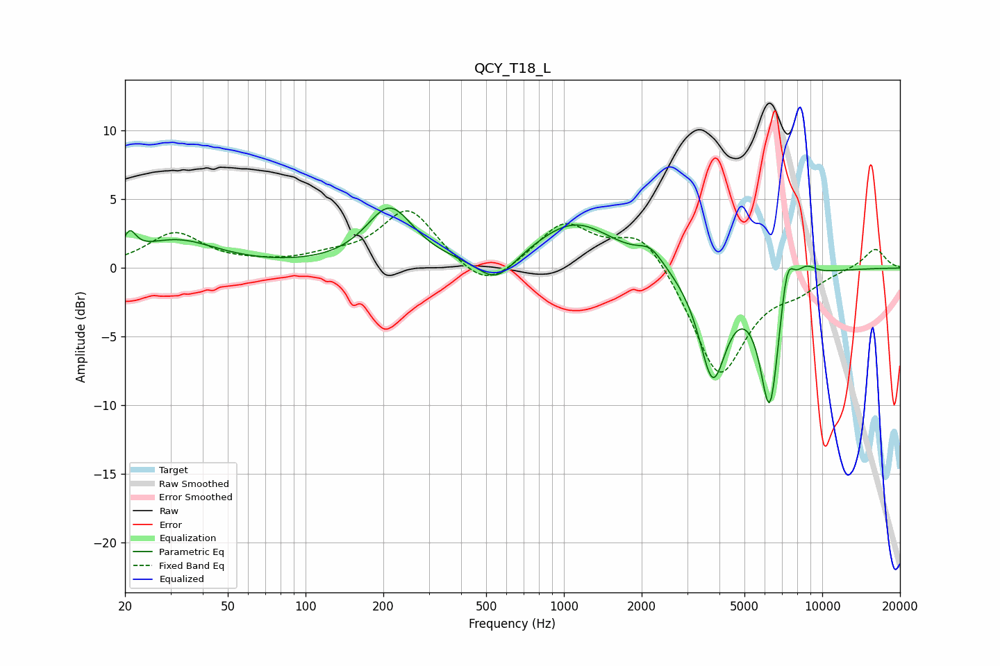

# QCY_T18_L
See [usage instructions](https://github.com/jaakkopasanen/AutoEq#usage) for more options and info.

### Parametric EQs
Apply preamp of -4.5 dB when using parametric equalizer.

|   # | Type    |   Fc (Hz) |    Q |   Gain (dB) |
|-----|---------|-----------|------|-------------|
|   1 | Peaking |        21 | 5.98 |         1.5 |
|   2 | Peaking |        32 | 0.91 |         2   |
|   3 | Peaking |       212 | 1.55 |         4.3 |
|   4 | Peaking |       547 | 1.95 |        -1.9 |
|   5 | Peaking |      1103 | 0.92 |         3.3 |
|   6 | Peaking |      2164 | 2.89 |         1.1 |
|   7 | Peaking |      3770 | 2.6  |        -7.8 |
|   8 | Peaking |      6267 | 3.47 |       -10   |
|   9 | Peaking |      7304 | 4.96 |         3.5 |
|  10 | Peaking |      8626 | 3.18 |         1   |

### Fixed Band EQs
When using fixed band (also called graphic) equalizer, apply preamp of **-4.3 dB** (if available) and set gains manually with these parameters.

|   # | Type    |   Fc (Hz) |    Q |   Gain (dB) |
|-----|---------|-----------|------|-------------|
|   1 | Peaking |        31 | 1.41 |         2.5 |
|   2 | Peaking |        62 | 1.41 |         0.2 |
|   3 | Peaking |       125 | 1.41 |         0.6 |
|   4 | Peaking |       250 | 1.41 |         4.3 |
|   5 | Peaking |       500 | 1.41 |        -2   |
|   6 | Peaking |      1000 | 1.41 |         3.2 |
|   7 | Peaking |      2000 | 1.41 |         2.9 |
|   8 | Peaking |      4000 | 1.41 |        -8   |
|   9 | Peaking |      8000 | 1.41 |        -1.2 |
|  10 | Peaking |     16000 | 1.41 |         1.5 |

### Graphs

