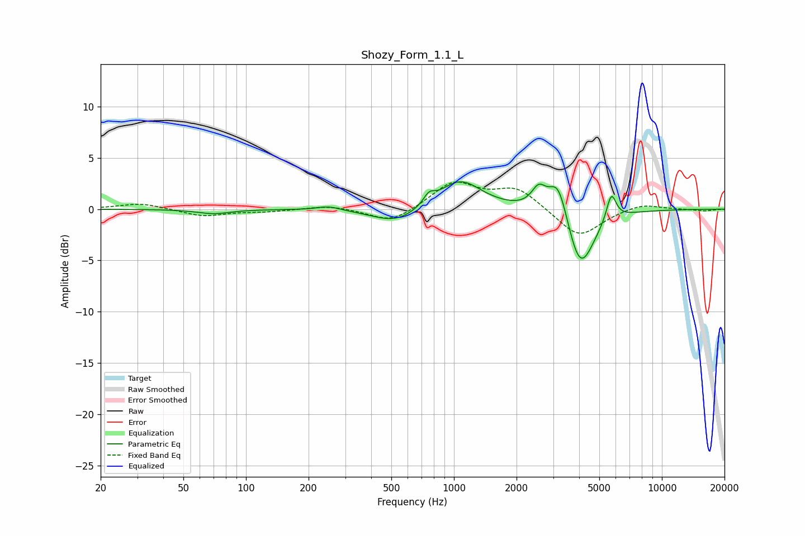

# Shozy_Form_1.1_L
See [usage instructions](https://github.com/jaakkopasanen/AutoEq#usage) for more options and info.

### Parametric EQs
Apply preamp of -2.8 dB when using parametric equalizer.

|   # | Type    |   Fc (Hz) |    Q |   Gain (dB) |
|-----|---------|-----------|------|-------------|
|   1 | Peaking |        70 | 1.79 |        -0.4 |
|   2 | Peaking |       250 | 2.56 |         0.4 |
|   3 | Peaking |       526 | 1.26 |        -1.5 |
|   4 | Peaking |       759 | 5.35 |         0.9 |
|   5 | Peaking |      1068 | 1.36 |         2.9 |
|   6 | Peaking |      2555 | 4.12 |         1.9 |
|   7 | Peaking |      3177 | 3.03 |         3.9 |
|   8 | Peaking |      4016 | 2.84 |        -1.5 |
|   9 | Peaking |      4069 | 1.96 |        -4.7 |
|  10 | Peaking |      5713 | 6    |         2.7 |

### Fixed Band EQs
When using fixed band (also called graphic) equalizer, apply preamp of **-2.7 dB** (if available) and set gains manually with these parameters.

|   # | Type    |   Fc (Hz) |    Q |   Gain (dB) |
|-----|---------|-----------|------|-------------|
|   1 | Peaking |        31 | 1.41 |         0.6 |
|   2 | Peaking |        62 | 1.41 |        -0.7 |
|   3 | Peaking |       125 | 1.41 |        -0.2 |
|   4 | Peaking |       250 | 1.41 |         0.4 |
|   5 | Peaking |       500 | 1.41 |        -1.4 |
|   6 | Peaking |      1000 | 1.41 |         2.6 |
|   7 | Peaking |      2000 | 1.41 |         2   |
|   8 | Peaking |      4000 | 1.41 |        -2.8 |
|   9 | Peaking |      8000 | 1.41 |         0.6 |
|  10 | Peaking |     16000 | 1.41 |        -0.2 |

### Graphs

