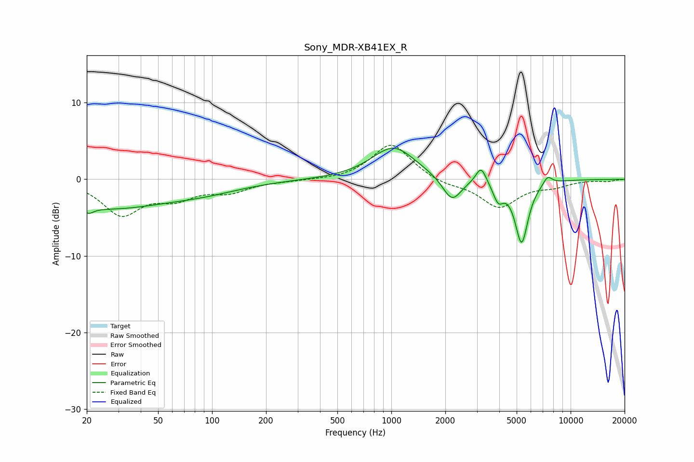

# Sony_MDR-XB41EX_R
See [usage instructions](https://github.com/jaakkopasanen/AutoEq#usage) for more options and info.

### Parametric EQs
Apply preamp of -4.1 dB when using parametric equalizer.

|   # | Type    |   Fc (Hz) |    Q |   Gain (dB) |
|-----|---------|-----------|------|-------------|
|   1 | Peaking |        21 | 5.8  |        -4   |
|   2 | Peaking |        21 | 5.98 |         3.2 |
|   3 | Peaking |        25 | 0.43 |        -3.6 |
|   4 | Peaking |        90 | 0.62 |        -1.2 |
|   5 | Peaking |      1029 | 1.16 |         4.3 |
|   6 | Peaking |      2178 | 2.67 |        -3.2 |
|   7 | Peaking |      3166 | 4.87 |         2.2 |
|   8 | Peaking |      3944 | 4.84 |        -2.3 |
|   9 | Peaking |      5327 | 3.76 |        -8.2 |
|  10 | Peaking |      7438 | 5.33 |         1.1 |

### Fixed Band EQs
When using fixed band (also called graphic) equalizer, apply preamp of **-4.5 dB** (if available) and set gains manually with these parameters.

|   # | Type    |   Fc (Hz) |    Q |   Gain (dB) |
|-----|---------|-----------|------|-------------|
|   1 | Peaking |        31 | 1.41 |        -4.4 |
|   2 | Peaking |        62 | 1.41 |        -2.1 |
|   3 | Peaking |       125 | 1.41 |        -1.4 |
|   4 | Peaking |       250 | 1.41 |        -0.2 |
|   5 | Peaking |       500 | 1.41 |        -0.1 |
|   6 | Peaking |      1000 | 1.41 |         4.7 |
|   7 | Peaking |      2000 | 1.41 |        -0.7 |
|   8 | Peaking |      4000 | 1.41 |        -3.6 |
|   9 | Peaking |      8000 | 1.41 |        -0.8 |
|  10 | Peaking |     16000 | 1.41 |        -0.2 |

### Graphs

