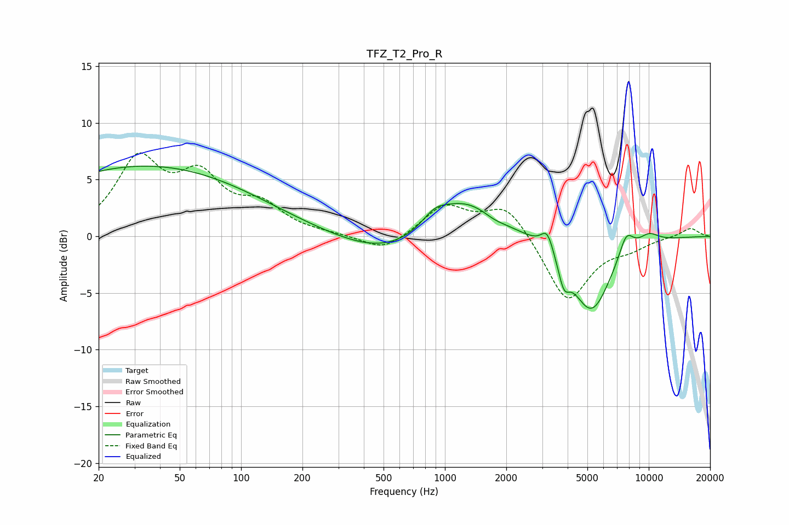

# TFZ_T2_Pro_R
See [usage instructions](https://github.com/jaakkopasanen/AutoEq#usage) for more options and info.

### Parametric EQs
Apply preamp of -6.3 dB when using parametric equalizer.

|   # | Type    |   Fc (Hz) |    Q |   Gain (dB) |
|-----|---------|-----------|------|-------------|
|   1 | Peaking |        34 | 0.25 |         6.2 |
|   2 | Peaking |       536 | 0.58 |        -2   |
|   3 | Peaking |       889 | 2.25 |         1.2 |
|   4 | Peaking |      1238 | 0.86 |         3.6 |
|   5 | Peaking |      1748 | 2.6  |        -0.4 |
|   6 | Peaking |      3179 | 4.59 |         1.9 |
|   7 | Peaking |      3833 | 5.16 |        -2.1 |
|   8 | Peaking |      5225 | 1.41 |        -6.7 |
|   9 | Peaking |      7756 | 3.68 |         2.1 |
|  10 | Peaking |     10000 | 2.4  |         0.9 |

### Fixed Band EQs
When using fixed band (also called graphic) equalizer, apply preamp of **-7.5 dB** (if available) and set gains manually with these parameters.

|   # | Type    |   Fc (Hz) |    Q |   Gain (dB) |
|-----|---------|-----------|------|-------------|
|   1 | Peaking |        31 | 1.41 |         6.4 |
|   2 | Peaking |        62 | 1.41 |         4.6 |
|   3 | Peaking |       125 | 1.41 |         2.4 |
|   4 | Peaking |       250 | 1.41 |         0.1 |
|   5 | Peaking |       500 | 1.41 |        -1.4 |
|   6 | Peaking |      1000 | 1.41 |         2.7 |
|   7 | Peaking |      2000 | 1.41 |         2.8 |
|   8 | Peaking |      4000 | 1.41 |        -5.9 |
|   9 | Peaking |      8000 | 1.41 |        -0.8 |
|  10 | Peaking |     16000 | 1.41 |         0.8 |

### Graphs

