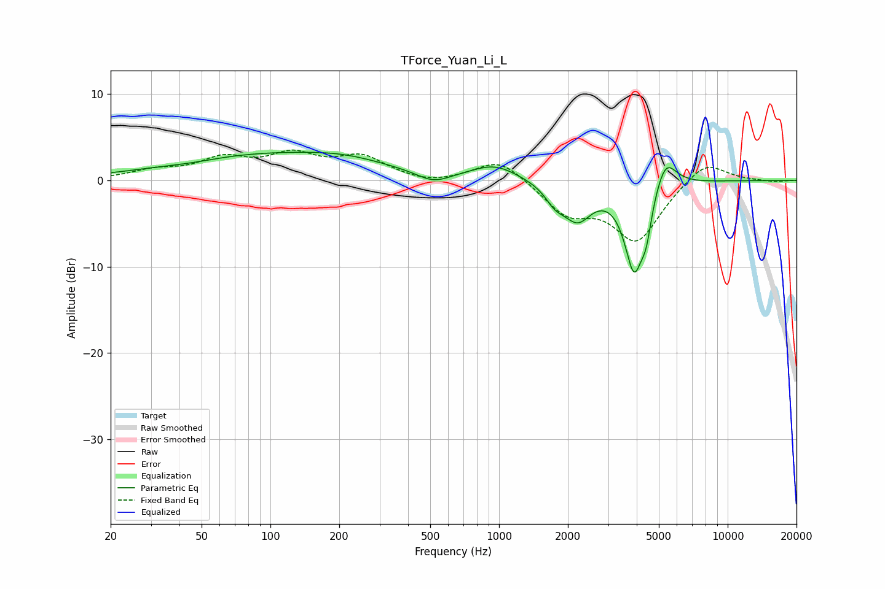

# TForce_Yuan_Li_L
See [usage instructions](https://github.com/jaakkopasanen/AutoEq#usage) for more options and info.

### Parametric EQs
Apply preamp of -3.4 dB when using parametric equalizer.

|   # | Type    |   Fc (Hz) |    Q |   Gain (dB) |
|-----|---------|-----------|------|-------------|
|   1 | Peaking |        45 | 1.15 |        -0.3 |
|   2 | Peaking |       100 | 0.32 |         3   |
|   3 | Peaking |       211 | 0.89 |         0.6 |
|   4 | Peaking |       517 | 1.92 |        -1.3 |
|   5 | Peaking |       959 | 1.39 |         1.7 |
|   6 | Peaking |      1754 | 3.35 |        -1.6 |
|   7 | Peaking |      2199 | 2.22 |        -4.1 |
|   8 | Peaking |      3897 | 3.26 |       -10   |
|   9 | Peaking |      4404 | 5.99 |        -3.2 |
|  10 | Peaking |      5342 | 2.95 |         3.7 |

### Fixed Band EQs
When using fixed band (also called graphic) equalizer, apply preamp of **-3.6 dB** (if available) and set gains manually with these parameters.

|   # | Type    |   Fc (Hz) |    Q |   Gain (dB) |
|-----|---------|-----------|------|-------------|
|   1 | Peaking |        31 | 1.41 |         1   |
|   2 | Peaking |        62 | 1.41 |         2.2 |
|   3 | Peaking |       125 | 1.41 |         2.6 |
|   4 | Peaking |       250 | 1.41 |         2.5 |
|   5 | Peaking |       500 | 1.41 |        -0.5 |
|   6 | Peaking |      1000 | 1.41 |         2.6 |
|   7 | Peaking |      2000 | 1.41 |        -3.6 |
|   8 | Peaking |      4000 | 1.41 |        -6.8 |
|   9 | Peaking |      8000 | 1.41 |         2.5 |
|  10 | Peaking |     16000 | 1.41 |        -0.2 |

### Graphs

