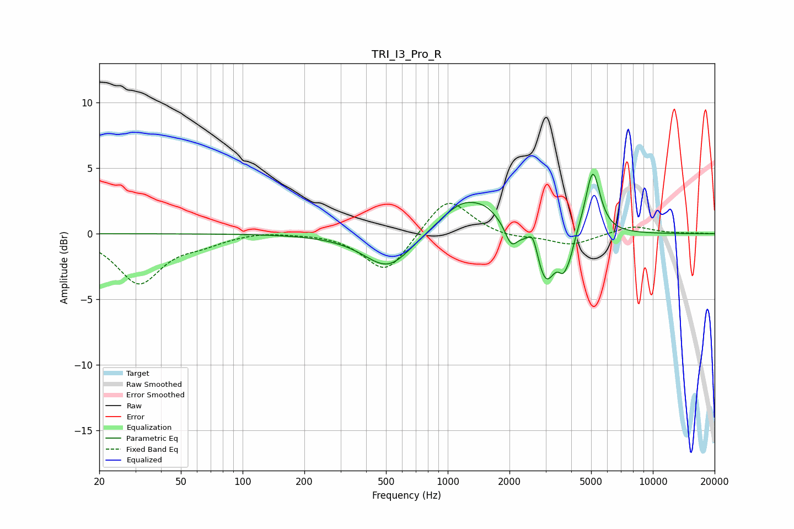

# TRI_I3_Pro_R
See [usage instructions](https://github.com/jaakkopasanen/AutoEq#usage) for more options and info.

### Parametric EQs
Apply preamp of -4.7 dB when using parametric equalizer.

|   # | Type    |   Fc (Hz) |    Q |   Gain (dB) |
|-----|---------|-----------|------|-------------|
|   1 | Peaking |       451 | 0.99 |        -0.5 |
|   2 | Peaking |       518 | 1.31 |        -2.3 |
|   3 | Peaking |      1191 | 1.21 |         2.5 |
|   4 | Peaking |      1573 | 2.04 |         0.8 |
|   5 | Peaking |      2041 | 4.94 |        -1.4 |
|   6 | Peaking |      2603 | 5.99 |         1.5 |
|   7 | Peaking |      3004 | 2.92 |        -3.9 |
|   8 | Peaking |      3656 | 5.96 |        -1.6 |
|   9 | Peaking |      3940 | 6    |        -1.1 |
|  10 | Peaking |      5096 | 3.92 |         4.9 |

### Fixed Band EQs
When using fixed band (also called graphic) equalizer, apply preamp of **-2.4 dB** (if available) and set gains manually with these parameters.

|   # | Type    |   Fc (Hz) |    Q |   Gain (dB) |
|-----|---------|-----------|------|-------------|
|   1 | Peaking |        31 | 1.41 |        -3.7 |
|   2 | Peaking |        62 | 1.41 |        -0.6 |
|   3 | Peaking |       125 | 1.41 |         0.2 |
|   4 | Peaking |       250 | 1.41 |         0.1 |
|   5 | Peaking |       500 | 1.41 |        -3.1 |
|   6 | Peaking |      1000 | 1.41 |         2.9 |
|   7 | Peaking |      2000 | 1.41 |        -0.4 |
|   8 | Peaking |      4000 | 1.41 |        -0.9 |
|   9 | Peaking |      8000 | 1.41 |         0.6 |
|  10 | Peaking |     16000 | 1.41 |         0   |

### Graphs

