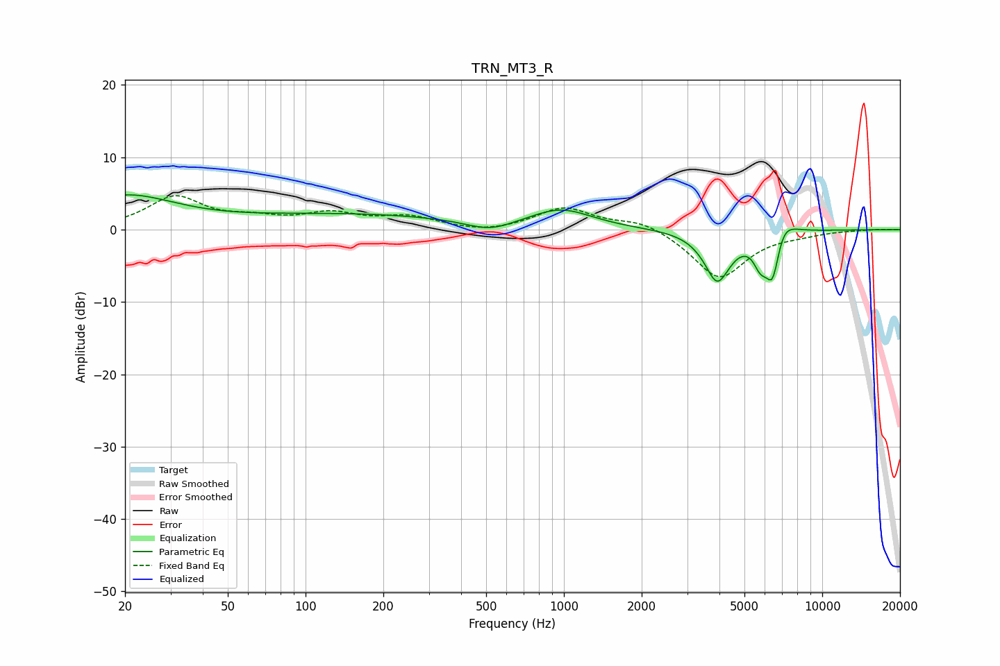

# TRN_MT3_R
See [usage instructions](https://github.com/jaakkopasanen/AutoEq#usage) for more options and info.

### Parametric EQs
Apply preamp of -4.9 dB when using parametric equalizer.

|   # | Type    |   Fc (Hz) |    Q |   Gain (dB) |
|-----|---------|-----------|------|-------------|
|   1 | Peaking |        20 | 0.72 |         4.5 |
|   2 | Peaking |       150 | 0.32 |         2   |
|   3 | Peaking |       517 | 1.57 |        -1.4 |
|   4 | Peaking |       976 | 1.18 |         2.6 |
|   5 | Peaking |      3948 | 2.88 |        -8.2 |
|   6 | Peaking |      4026 | 3.95 |         1.3 |
|   7 | Peaking |      5764 | 4.96 |        -3.2 |
|   8 | Peaking |      6431 | 4.87 |        -6.8 |
|   9 | Peaking |      6960 | 3.54 |         2.2 |
|  10 | Peaking |      7267 | 2.28 |         0.8 |

### Fixed Band EQs
When using fixed band (also called graphic) equalizer, apply preamp of **-4.8 dB** (if available) and set gains manually with these parameters.

|   # | Type    |   Fc (Hz) |    Q |   Gain (dB) |
|-----|---------|-----------|------|-------------|
|   1 | Peaking |        31 | 1.41 |         4.4 |
|   2 | Peaking |        62 | 1.41 |         1.2 |
|   3 | Peaking |       125 | 1.41 |         2   |
|   4 | Peaking |       250 | 1.41 |         1.6 |
|   5 | Peaking |       500 | 1.41 |        -0.6 |
|   6 | Peaking |      1000 | 1.41 |         3   |
|   7 | Peaking |      2000 | 1.41 |         1.4 |
|   8 | Peaking |      4000 | 1.41 |        -6.8 |
|   9 | Peaking |      8000 | 1.41 |        -0.4 |
|  10 | Peaking |     16000 | 1.41 |         0.1 |

### Graphs

