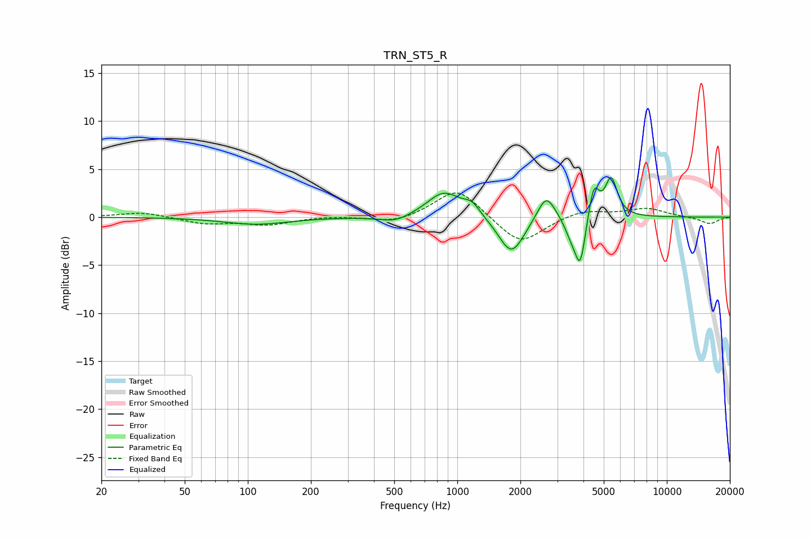

# TRN_ST5_R
See [usage instructions](https://github.com/jaakkopasanen/AutoEq#usage) for more options and info.

### Parametric EQs
Apply preamp of -4.2 dB when using parametric equalizer.

|   # | Type    |   Fc (Hz) |    Q |   Gain (dB) |
|-----|---------|-----------|------|-------------|
|   1 | Peaking |       109 | 0.92 |        -0.7 |
|   2 | Peaking |       505 | 1.96 |        -0.7 |
|   3 | Peaking |       863 | 1.76 |         2.7 |
|   4 | Peaking |      1174 | 3.5  |         1.1 |
|   5 | Peaking |      1813 | 2.32 |        -4   |
|   6 | Peaking |      2657 | 3.3  |         2.8 |
|   7 | Peaking |      3493 | 4.49 |        -1.5 |
|   8 | Peaking |      3862 | 5.65 |        -4.9 |
|   9 | Peaking |      4481 | 5.61 |         3.4 |
|  10 | Peaking |      5427 | 4.82 |         3.9 |

### Fixed Band EQs
When using fixed band (also called graphic) equalizer, apply preamp of **-2.6 dB** (if available) and set gains manually with these parameters.

|   # | Type    |   Fc (Hz) |    Q |   Gain (dB) |
|-----|---------|-----------|------|-------------|
|   1 | Peaking |        31 | 1.41 |         0.5 |
|   2 | Peaking |        62 | 1.41 |        -0.7 |
|   3 | Peaking |       125 | 1.41 |        -0.7 |
|   4 | Peaking |       250 | 1.41 |         0.1 |
|   5 | Peaking |       500 | 1.41 |        -0.7 |
|   6 | Peaking |      1000 | 1.41 |         3.1 |
|   7 | Peaking |      2000 | 1.41 |        -3   |
|   8 | Peaking |      4000 | 1.41 |         0.8 |
|   9 | Peaking |      8000 | 1.41 |         0.9 |
|  10 | Peaking |     16000 | 1.41 |        -0.7 |

### Graphs

