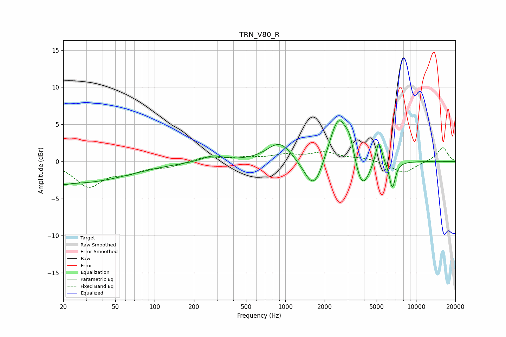

# TRN_V80_R
See [usage instructions](https://github.com/jaakkopasanen/AutoEq#usage) for more options and info.

### Parametric EQs
Apply preamp of -5.6 dB when using parametric equalizer.

|   # | Type    |   Fc (Hz) |    Q |   Gain (dB) |
|-----|---------|-----------|------|-------------|
|   1 | Peaking |        21 | 4.74 |        -0.3 |
|   2 | Peaking |        25 | 0.35 |        -2.9 |
|   3 | Peaking |       278 | 1.79 |         0.8 |
|   4 | Peaking |       907 | 1.5  |         2.7 |
|   5 | Peaking |      1655 | 1.91 |        -4.7 |
|   6 | Peaking |      2550 | 1.96 |         6.8 |
|   7 | Peaking |      3115 | 4.29 |         2   |
|   8 | Peaking |      3860 | 2.49 |        -4.6 |
|   9 | Peaking |      5187 | 5.64 |         3.3 |
|  10 | Peaking |      6588 | 6    |        -3.6 |

### Fixed Band EQs
When using fixed band (also called graphic) equalizer, apply preamp of **-1.9 dB** (if available) and set gains manually with these parameters.

|   # | Type    |   Fc (Hz) |    Q |   Gain (dB) |
|-----|---------|-----------|------|-------------|
|   1 | Peaking |        31 | 1.41 |        -3.3 |
|   2 | Peaking |        62 | 1.41 |        -1.2 |
|   3 | Peaking |       125 | 1.41 |        -0.6 |
|   4 | Peaking |       250 | 1.41 |         0.6 |
|   5 | Peaking |       500 | 1.41 |         0.4 |
|   6 | Peaking |      1000 | 1.41 |         0.7 |
|   7 | Peaking |      2000 | 1.41 |         1.1 |
|   8 | Peaking |      4000 | 1.41 |         0.4 |
|   9 | Peaking |      8000 | 1.41 |        -1.6 |
|  10 | Peaking |     16000 | 1.41 |         1.9 |

### Graphs

