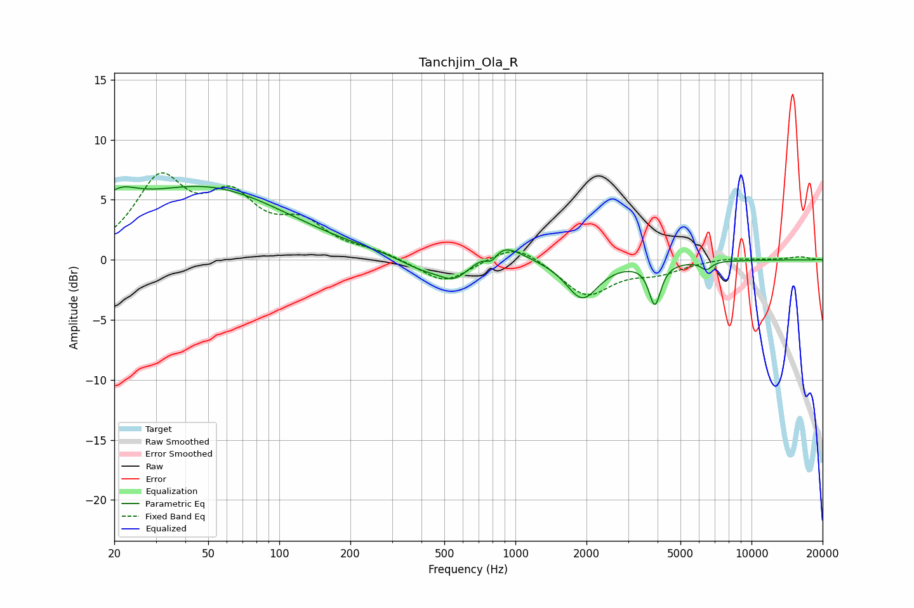

# Tanchjim_Ola_R
See [usage instructions](https://github.com/jaakkopasanen/AutoEq#usage) for more options and info.

### Parametric EQs
Apply preamp of -6.2 dB when using parametric equalizer.

|   # | Type    |   Fc (Hz) |    Q |   Gain (dB) |
|-----|---------|-----------|------|-------------|
|   1 | Peaking |        20 | 1.65 |         2.4 |
|   2 | Peaking |        20 | 5.86 |        -0.1 |
|   3 | Peaking |        48 | 0.4  |         5.9 |
|   4 | Peaking |       398 | 1.55 |        -0.9 |
|   5 | Peaking |       553 | 2.02 |        -1.8 |
|   6 | Peaking |       793 | 5.6  |        -0.9 |
|   7 | Peaking |       862 | 1.69 |         1.7 |
|   8 | Peaking |      1920 | 2.07 |        -3.2 |
|   9 | Peaking |      3897 | 5.69 |        -3.5 |
|  10 | Peaking |      6439 | 5.9  |        -0.7 |

### Fixed Band EQs
When using fixed band (also called graphic) equalizer, apply preamp of **-7.3 dB** (if available) and set gains manually with these parameters.

|   # | Type    |   Fc (Hz) |    Q |   Gain (dB) |
|-----|---------|-----------|------|-------------|
|   1 | Peaking |        31 | 1.41 |         6.3 |
|   2 | Peaking |        62 | 1.41 |         4.4 |
|   3 | Peaking |       125 | 1.41 |         2.6 |
|   4 | Peaking |       250 | 1.41 |         0.6 |
|   5 | Peaking |       500 | 1.41 |        -2   |
|   6 | Peaking |      1000 | 1.41 |         1.5 |
|   7 | Peaking |      2000 | 1.41 |        -3   |
|   8 | Peaking |      4000 | 1.41 |        -0.9 |
|   9 | Peaking |      8000 | 1.41 |         0.2 |
|  10 | Peaking |     16000 | 1.41 |         0.3 |

### Graphs

