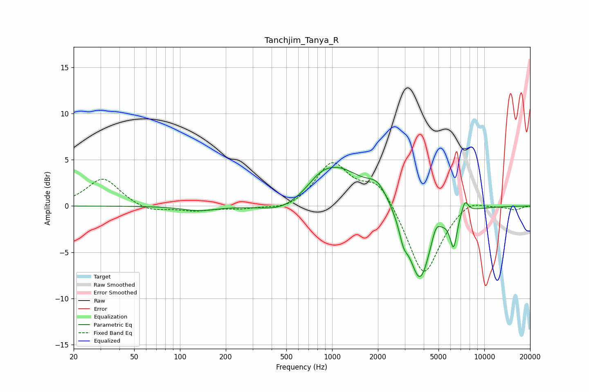

# Tanchjim_Tanya_R
See [usage instructions](https://github.com/jaakkopasanen/AutoEq#usage) for more options and info.

### Parametric EQs
Apply preamp of -4.3 dB when using parametric equalizer.

|   # | Type    |   Fc (Hz) |    Q |   Gain (dB) |
|-----|---------|-----------|------|-------------|
|   1 | Peaking |       134 | 1.29 |        -0.5 |
|   2 | Peaking |       487 | 0.98 |        -1.3 |
|   3 | Peaking |       833 | 2.02 |         0.6 |
|   4 | Peaking |      1064 | 0.82 |         4.3 |
|   5 | Peaking |      1996 | 2.1  |         1.8 |
|   6 | Peaking |      2943 | 5.08 |        -1.7 |
|   7 | Peaking |      3771 | 1.92 |        -8.3 |
|   8 | Peaking |      4808 | 4.77 |         1.5 |
|   9 | Peaking |      6282 | 5.96 |        -3.5 |
|  10 | Peaking |      7465 | 6    |         1.5 |

### Fixed Band EQs
When using fixed band (also called graphic) equalizer, apply preamp of **-4.8 dB** (if available) and set gains manually with these parameters.

|   # | Type    |   Fc (Hz) |    Q |   Gain (dB) |
|-----|---------|-----------|------|-------------|
|   1 | Peaking |        31 | 1.41 |         3   |
|   2 | Peaking |        62 | 1.41 |        -0.7 |
|   3 | Peaking |       125 | 1.41 |        -0.5 |
|   4 | Peaking |       250 | 1.41 |        -0.3 |
|   5 | Peaking |       500 | 1.41 |        -0.6 |
|   6 | Peaking |      1000 | 1.41 |         4.6 |
|   7 | Peaking |      2000 | 1.41 |         2.8 |
|   8 | Peaking |      4000 | 1.41 |        -7.8 |
|   9 | Peaking |      8000 | 1.41 |         1   |
|  10 | Peaking |     16000 | 1.41 |        -0.4 |

### Graphs

