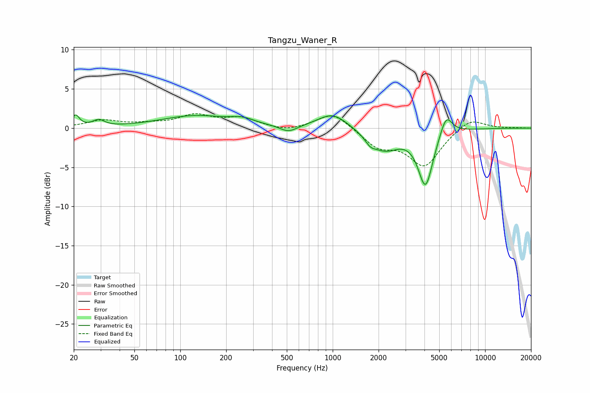

# Tangzu_Waner_R
See [usage instructions](https://github.com/jaakkopasanen/AutoEq#usage) for more options and info.

### Parametric EQs
Apply preamp of -1.8 dB when using parametric equalizer.

|   # | Type    |   Fc (Hz) |    Q |   Gain (dB) |
|-----|---------|-----------|------|-------------|
|   1 | Peaking |        21 | 5.77 |         1.5 |
|   2 | Peaking |        29 | 3.8  |         0.8 |
|   3 | Peaking |       125 | 0.63 |         1.5 |
|   4 | Peaking |       255 | 1.87 |         0.7 |
|   5 | Peaking |       513 | 2.46 |        -0.9 |
|   6 | Peaking |      1001 | 1.45 |         2   |
|   7 | Peaking |      1765 | 4.03 |        -0.9 |
|   8 | Peaking |      2192 | 1.47 |        -2.6 |
|   9 | Peaking |      4065 | 2.87 |        -7.1 |
|  10 | Peaking |      5548 | 3.49 |         2.7 |

### Fixed Band EQs
When using fixed band (also called graphic) equalizer, apply preamp of **-1.9 dB** (if available) and set gains manually with these parameters.

|   # | Type    |   Fc (Hz) |    Q |   Gain (dB) |
|-----|---------|-----------|------|-------------|
|   1 | Peaking |        31 | 1.41 |         0.9 |
|   2 | Peaking |        62 | 1.41 |         0.4 |
|   3 | Peaking |       125 | 1.41 |         1.5 |
|   4 | Peaking |       250 | 1.41 |         1.2 |
|   5 | Peaking |       500 | 1.41 |        -0.5 |
|   6 | Peaking |      1000 | 1.41 |         2.1 |
|   7 | Peaking |      2000 | 1.41 |        -2.2 |
|   8 | Peaking |      4000 | 1.41 |        -4.7 |
|   9 | Peaking |      8000 | 1.41 |         1.4 |
|  10 | Peaking |     16000 | 1.41 |         0   |

### Graphs

