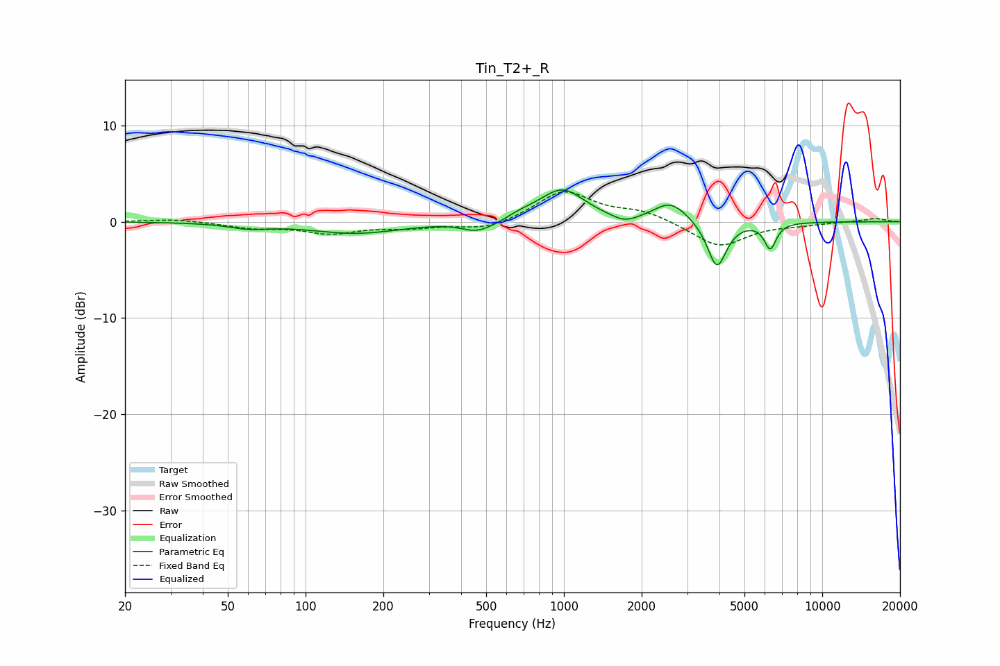

# Tin_T2+_R
See [usage instructions](https://github.com/jaakkopasanen/AutoEq#usage) for more options and info.

### Parametric EQs
Apply preamp of -3.4 dB when using parametric equalizer.

|   # | Type    |   Fc (Hz) |    Q |   Gain (dB) |
|-----|---------|-----------|------|-------------|
|   1 | Peaking |        61 | 1.79 |        -0.5 |
|   2 | Peaking |       156 | 0.82 |        -1.2 |
|   3 | Peaking |       455 | 2.62 |        -0.9 |
|   4 | Peaking |       537 | 2.2  |        -0.5 |
|   5 | Peaking |       677 | 2.18 |         0.4 |
|   6 | Peaking |       984 | 1.62 |         3.3 |
|   7 | Peaking |      1721 | 2.72 |        -0.8 |
|   8 | Peaking |      2590 | 2.16 |         2   |
|   9 | Peaking |      3912 | 3.81 |        -4.9 |
|  10 | Peaking |      6294 | 6    |        -2.7 |

### Fixed Band EQs
When using fixed band (also called graphic) equalizer, apply preamp of **-3.2 dB** (if available) and set gains manually with these parameters.

|   # | Type    |   Fc (Hz) |    Q |   Gain (dB) |
|-----|---------|-----------|------|-------------|
|   1 | Peaking |        31 | 1.41 |         0.3 |
|   2 | Peaking |        62 | 1.41 |        -0.6 |
|   3 | Peaking |       125 | 1.41 |        -1.1 |
|   4 | Peaking |       250 | 1.41 |        -0.5 |
|   5 | Peaking |       500 | 1.41 |        -0.9 |
|   6 | Peaking |      1000 | 1.41 |         3.2 |
|   7 | Peaking |      2000 | 1.41 |         1   |
|   8 | Peaking |      4000 | 1.41 |        -2.6 |
|   9 | Peaking |      8000 | 1.41 |        -0.2 |
|  10 | Peaking |     16000 | 1.41 |         0.4 |

### Graphs

