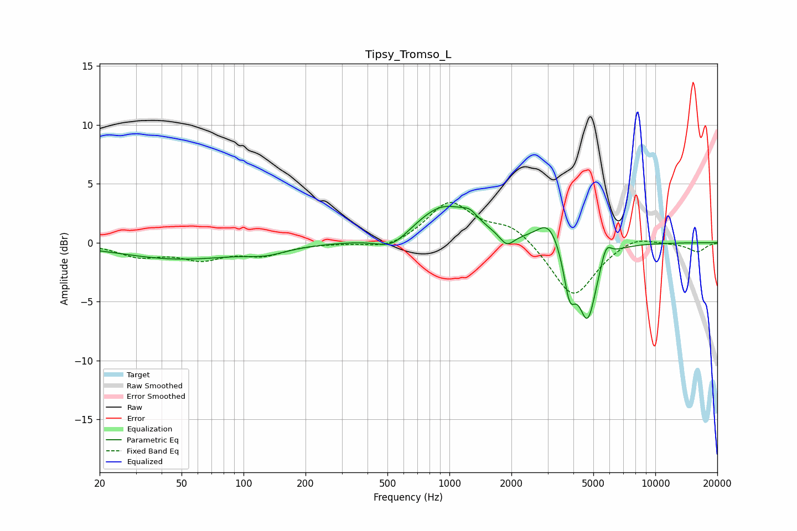

# Tipsy_Tromso_L
See [usage instructions](https://github.com/jaakkopasanen/AutoEq#usage) for more options and info.

### Parametric EQs
Apply preamp of -3.2 dB when using parametric equalizer.

|   # | Type    |   Fc (Hz) |    Q |   Gain (dB) |
|-----|---------|-----------|------|-------------|
|   1 | Peaking |        49 | 0.48 |        -1.4 |
|   2 | Peaking |       129 | 1.46 |        -0.5 |
|   3 | Peaking |       527 | 1.84 |        -1.2 |
|   4 | Peaking |       938 | 1.04 |         3.2 |
|   5 | Peaking |      1257 | 3.76 |         0.7 |
|   6 | Peaking |      1899 | 4.03 |        -1.1 |
|   7 | Peaking |      3041 | 2.46 |         2.1 |
|   8 | Peaking |      3836 | 4.88 |        -3.8 |
|   9 | Peaking |      4691 | 3.15 |        -6.3 |
|  10 | Peaking |      5763 | 5.49 |         1.5 |

### Fixed Band EQs
When using fixed band (also called graphic) equalizer, apply preamp of **-3.5 dB** (if available) and set gains manually with these parameters.

|   # | Type    |   Fc (Hz) |    Q |   Gain (dB) |
|-----|---------|-----------|------|-------------|
|   1 | Peaking |        31 | 1.41 |        -1.1 |
|   2 | Peaking |        62 | 1.41 |        -1.2 |
|   3 | Peaking |       125 | 1.41 |        -0.9 |
|   4 | Peaking |       250 | 1.41 |        -0   |
|   5 | Peaking |       500 | 1.41 |        -0.6 |
|   6 | Peaking |      1000 | 1.41 |         3.4 |
|   7 | Peaking |      2000 | 1.41 |         1.5 |
|   8 | Peaking |      4000 | 1.41 |        -4.7 |
|   9 | Peaking |      8000 | 1.41 |         0.7 |
|  10 | Peaking |     16000 | 1.41 |        -0.8 |

### Graphs

