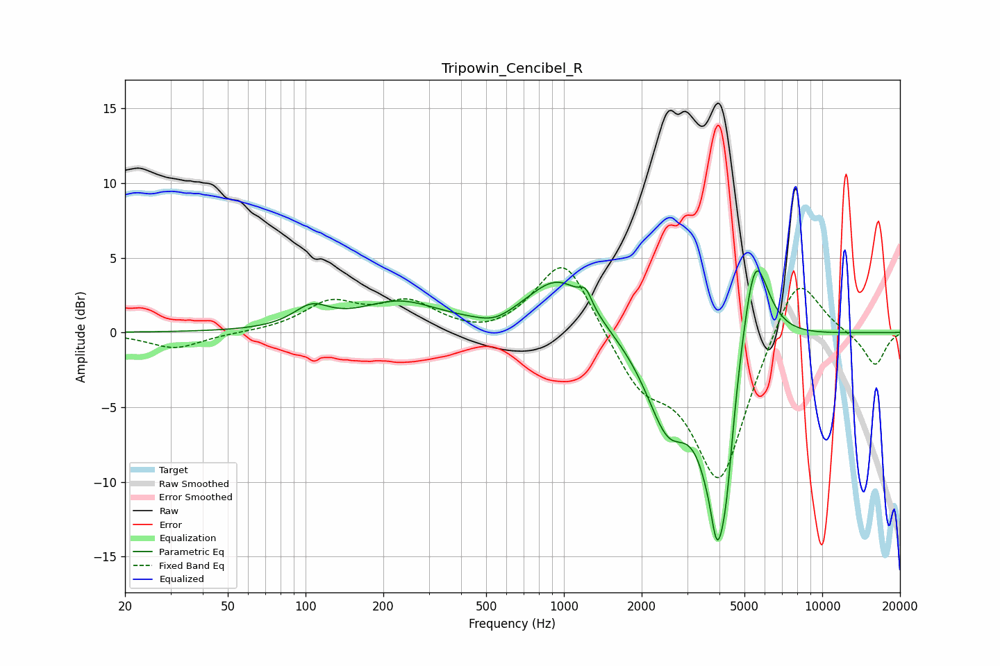

# Tripowin_Cencibel_R
See [usage instructions](https://github.com/jaakkopasanen/AutoEq#usage) for more options and info.

### Parametric EQs
Apply preamp of -4.2 dB when using parametric equalizer.

|   # | Type    |   Fc (Hz) |    Q |   Gain (dB) |
|-----|---------|-----------|------|-------------|
|   1 | Peaking |       105 | 2.06 |         1.3 |
|   2 | Peaking |       230 | 0.91 |         1.9 |
|   3 | Peaking |       540 | 2.06 |        -0.6 |
|   4 | Peaking |       954 | 1.16 |         3.7 |
|   5 | Peaking |      1215 | 5.98 |         1   |
|   6 | Peaking |      2523 | 1.65 |        -5.7 |
|   7 | Peaking |      3742 | 5.97 |         1.5 |
|   8 | Peaking |      3897 | 2.93 |       -13.9 |
|   9 | Peaking |      4271 | 6    |        -2.9 |
|  10 | Peaking |      5474 | 2.57 |         7.5 |

### Fixed Band EQs
When using fixed band (also called graphic) equalizer, apply preamp of **-4.4 dB** (if available) and set gains manually with these parameters.

|   # | Type    |   Fc (Hz) |    Q |   Gain (dB) |
|-----|---------|-----------|------|-------------|
|   1 | Peaking |        31 | 1.41 |        -1.1 |
|   2 | Peaking |        62 | 1.41 |        -0   |
|   3 | Peaking |       125 | 1.41 |         1.9 |
|   4 | Peaking |       250 | 1.41 |         1.8 |
|   5 | Peaking |       500 | 1.41 |        -0.5 |
|   6 | Peaking |      1000 | 1.41 |         5.2 |
|   7 | Peaking |      2000 | 1.41 |        -3.2 |
|   8 | Peaking |      4000 | 1.41 |       -10   |
|   9 | Peaking |      8000 | 1.41 |         4.7 |
|  10 | Peaking |     16000 | 1.41 |        -2.2 |

### Graphs

