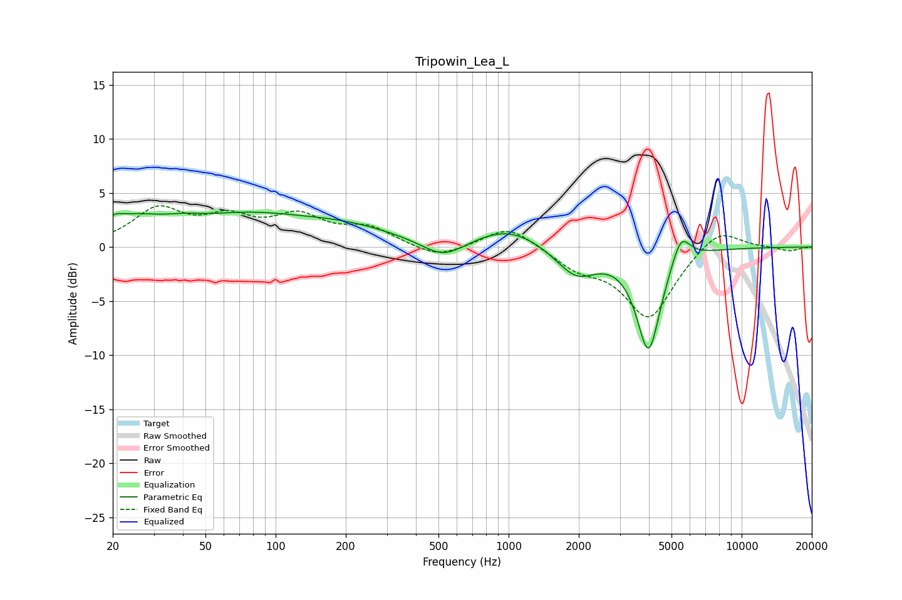

# Tripowin_Lea_L
See [usage instructions](https://github.com/jaakkopasanen/AutoEq#usage) for more options and info.

### Parametric EQs
Apply preamp of -3.3 dB when using parametric equalizer.

|   # | Type    |   Fc (Hz) |    Q |   Gain (dB) |
|-----|---------|-----------|------|-------------|
|   1 | Peaking |        21 | 5.7  |         0.4 |
|   2 | Peaking |        23 | 1.03 |         2.1 |
|   3 | Peaking |        40 | 1.59 |         0.6 |
|   4 | Peaking |        74 | 0.58 |         2.4 |
|   5 | Peaking |       198 | 0.61 |         1.6 |
|   6 | Peaking |       524 | 1.52 |        -1.8 |
|   7 | Peaking |       998 | 0.96 |         1.8 |
|   8 | Peaking |      1947 | 1.61 |        -2.7 |
|   9 | Peaking |      3986 | 2.7  |        -9.5 |
|  10 | Peaking |      5484 | 3.55 |         2.7 |

### Fixed Band EQs
When using fixed band (also called graphic) equalizer, apply preamp of **-3.9 dB** (if available) and set gains manually with these parameters.

|   # | Type    |   Fc (Hz) |    Q |   Gain (dB) |
|-----|---------|-----------|------|-------------|
|   1 | Peaking |        31 | 1.41 |         3.3 |
|   2 | Peaking |        62 | 1.41 |         2.3 |
|   3 | Peaking |       125 | 1.41 |         2.5 |
|   4 | Peaking |       250 | 1.41 |         1.6 |
|   5 | Peaking |       500 | 1.41 |        -1.1 |
|   6 | Peaking |      1000 | 1.41 |         2.1 |
|   7 | Peaking |      2000 | 1.41 |        -1.7 |
|   8 | Peaking |      4000 | 1.41 |        -6.5 |
|   9 | Peaking |      8000 | 1.41 |         2   |
|  10 | Peaking |     16000 | 1.41 |        -0.4 |

### Graphs

